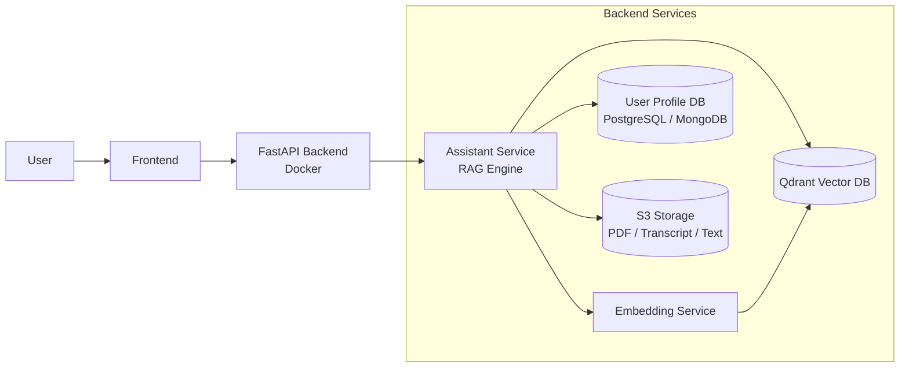
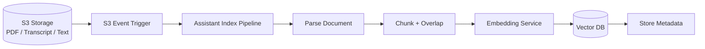
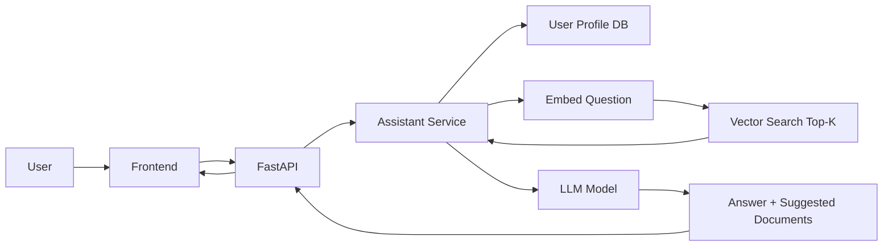

Dưới đây là **cách viết lại toàn bộ nội dung thành 1 phần lớn duy nhất:**

# A. RAG + Gợi ý học (Learning Recommendation System)

Hệ thống sử dụng **Retrieval Augmented Generation (RAG)** để trả lời câu hỏi của người học và gợi ý tài liệu phù hợp dựa trên **tài liệu học trong S3** và **profile người dùng trong database**.

---

# 1. Sơ đồ RAG tổng quan

## 1.1 Kiến trúc hệ thống



### Thành phần chính

**S3 Storage**

* lưu tài liệu học: PDF, video transcript, text

**User Profile Database**

* lưu thông tin người học:

  * level
  * sở thích
  * lịch sử học

**Embedding Service**

* tạo embedding cho:

  * document chunks
  * user question

**Qdrant Vector Database**

* lưu vector embedding
* lưu metadata tài liệu

**Assistant Service**

* thực hiện pipeline RAG
* xây dựng prompt cho LLM
* gợi ý tài liệu học

---

# 2. Pipeline index tài liệu (S3 → Vector DB)

Khi có **tài liệu mới được upload lên S3**, hệ thống tự động index tài liệu vào vector database.



### Flow hoạt động

1. File được upload lên **S3**
2. **S3 Event Notification** trigger pipeline index
3. Assistant service:

   * parse tài liệu
   * chia thành nhiều **chunk**
4. áp dụng **overlap giữa các chunk**
5. gửi chunk đến **Embedding Service**
6. embedding vector được lưu vào **Qdrant**
7. metadata tài liệu cũng được lưu kèm

---

# 3. Pipeline khi user đặt câu hỏi (RAG)

Khi user đặt câu hỏi, hệ thống sẽ tìm tài liệu liên quan và sử dụng LLM để tạo câu trả lời.



### Flow hoạt động

1. User gửi câu hỏi từ **Frontend**
2. FastAPI gửi request đến **Assistant Service**
3. Assistant:

   * lấy **profile user từ DB**
   * embedding câu hỏi
4. hệ thống tìm kiếm tài liệu trong **Vector DB**
5. lấy **top-k document chunks**
6. xây dựng prompt và gọi **LLM**
7. trả về:

   * câu trả lời
   * gợi ý tài liệu học liên quan

---

# 4. Thiết kế Chunk và Metadata

## Chunk Size

Tài liệu dài cần được chia nhỏ để tối ưu retrieval.

Ví dụ cấu hình:

```
chunk_size = 400 – 600 tokens
overlap = 80 – 120 tokens
```

### Lý do

* chunk nhỏ giúp **semantic search chính xác hơn**
* overlap giúp **không mất ngữ cảnh giữa các đoạn**

Ví dụ:

```
Chunk 1: tokens 0–500
Chunk 2: tokens 400–900
```

---

## Metadata

Metadata giúp hệ thống:

* lọc tài liệu theo **level**
* gợi ý tài liệu phù hợp
* truy xuất nguồn dữ liệu

Ví dụ metadata lưu trong vector DB:

```json
{
  "doc_id": "ml_course_01",
  "chunk_id": 5,
  "topic": "machine learning",
  "level": "beginner",
  "source": "pdf",
  "upload_date": "2026-03-05"
}
```

Các trường metadata quan trọng:

| Field       | Ý nghĩa                 |
| ----------- | ----------------------- |
| doc_id      | ID tài liệu             |
| chunk_id    | ID đoạn văn             |
| topic       | chủ đề                  |
| level       | beginner / intermediate |
| source      | pdf / transcript / text |
| upload_date | ngày upload             |

Vector DB có thể filter theo level:

```
level <= user_level
```

---

# 5. Thiết kế Prompt cho LLM

Prompt được thiết kế để:

* điều chỉnh câu trả lời theo **level người học**
* tránh trả lời chung chung
* trích dẫn tài liệu học

Ví dụ prompt template:

```
You are an AI learning assistant.

User level: {level}

Use the provided learning materials to answer the question.

Rules:
1. Adjust explanation based on the user's level.
2. For beginner users, explain concepts simply.
3. Avoid vague or generic answers.
4. Cite the relevant learning materials.

Context:
{retrieved_chunks}

Question:
{user_question}

Output format:

Answer:
...

Recommended materials:
- Title
- Short description
```

---

# 6. Cơ chế gợi ý tài liệu học

Sau khi hệ thống retrieve document chunks từ vector DB:

Assistant Service sẽ:

```
group by doc_id
```

để xác định các tài liệu liên quan.

Output trả về cho user gồm:

* câu trả lời
* danh sách tài liệu học nên đọc

Ví dụ:

```
Answer:
Overfitting occurs when a model learns the training data too well.

Recommended materials:

1. Introduction to Machine Learning
2. Understanding Bias and Variance
```

---

# 7. Giải thích thêm về thiết kế

## Tách Embedding Service

Embedding được tách thành service riêng vì:

* embedding tốn compute
* dễ scale
* dễ thay đổi model embedding

Ví dụ model embedding:

* BGE
* E5
* OpenAI embedding

---

## Vai trò của Vector Database

Vector DB giúp:

* semantic search
* similarity search
* metadata filtering

Ví dụ:

```
top_k = 5
```

Hệ thống sẽ lấy **5 document chunks liên quan nhất** để đưa vào prompt.

---

# Kết luận

Hệ thống gồm **2 pipeline chính**:

### Index pipeline

```
S3 upload
→ parse document
→ chunk + overlap
→ embedding
→ lưu vào vector DB
```

### Query pipeline

```
User question
→ embedding question
→ vector search
→ build prompt
→ LLM
→ answer + document recommendation
```

Thiết kế này đảm bảo:

* tài liệu được **index tự động**
* retrieval phù hợp với **level người học**
* câu trả lời luôn đi kèm **gợi ý tài liệu học phù hợp**.
