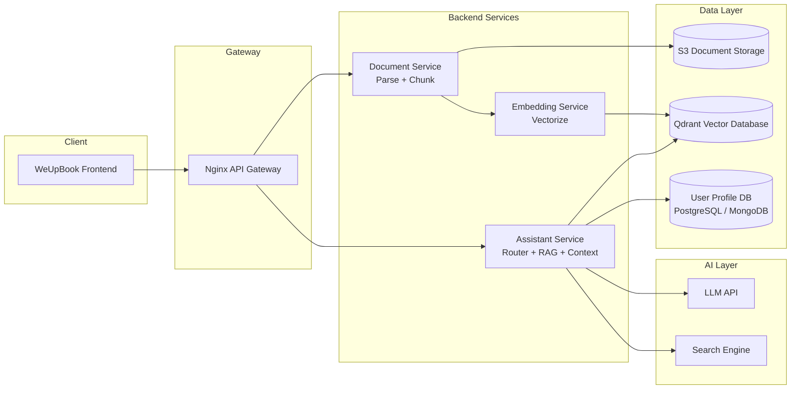
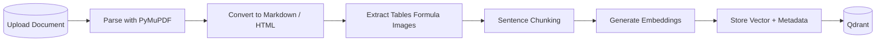
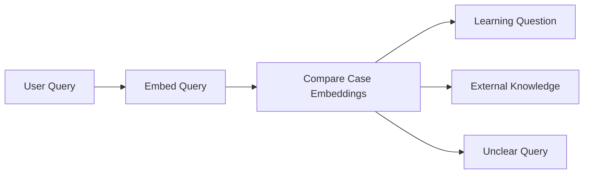
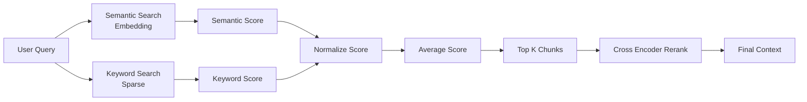

# A. Thiết kế RAG + Gợi ý học cho hệ thống tài liệu giáo dục

Hệ thống được thiết kế để hỗ trợ người học tìm kiếm kiến thức trong tài liệu học tập và nhận được **gợi ý tài liệu phù hợp với trình độ, sở thích và lịch sử học tập**.

Kiến trúc sử dụng **Retrieval-Augmented Generation (RAG)** kết hợp:

* **Hybrid Search**
* **Semantic Router**
* **Context Engineering**
* **Cá nhân hóa theo hồ sơ người học**

Backend triển khai theo **microservices với 3 service chính**:

* **Document Service**
* **Embedding Service**
* **Assistant Service**

Các service chạy bằng **FastAPI + Docker** và được truy cập thông qua **Nginx Gateway**.

---

# 1. Kiến trúc tổng thể hệ thống

Hệ thống gồm hai luồng chính:

* **Document Ingestion Pipeline** (xử lý tài liệu)
* **User Query Pipeline** (trả lời câu hỏi)



### Vai trò các service

| Service           | Chức năng                             |
| ----------------- | ------------------------------------- |
| Document Service  | xử lý và phân đoạn tài liệu           |
| Embedding Service | tạo vector embedding                  |
| Assistant Service | router + retrieval + prompt + gọi LLM |

---

# 2. Pipeline xử lý tài liệu (Document Ingestion)

Khi tài liệu mới được tải lên hệ thống, pipeline sẽ tự động chuyển tài liệu thành vector để phục vụ RAG.



### Chiến lược xử lý tài liệu

**1. Parsing**

Sử dụng **PyMuPDF** để:

* chuyển PDF → **Markdown hoặc HTML**
* giữ nguyên cấu trúc:

  * heading
  * bảng
  * công thức LaTeX
  * code block
  * hình ảnh

---

**2. Chunking**

Thực hiện **chunk theo câu (sentence-based chunking)** để tránh cắt mất ý nghĩa.

Cấu hình:

| tham số    | giá trị         |
| ---------- | --------------- |
| chunk size | 512–1024 tokens |
| overlap    | 10–15%          |

Ví dụ:

```
Chunk 1
Sentence 1
Sentence 2
Sentence 3

Chunk 2
Sentence 3
Sentence 4
Sentence 5
```

---

**3. Xử lý nội dung đặc biệt**

| loại dữ liệu | xử lý                      |
| ------------ | -------------------------- |
| bảng         | giữ HTML table             |
| công thức    | latex                      |
| ảnh          | trích caption để embedding |
| code         | markdown block             |

---

# 3. Schema Vector Database (Qdrant)

Vector database dùng để lưu embedding của từng đoạn tài liệu.

### Collection

```
collection: learning_documents
```

### Vector config

```
vector_size: 768 hoặc 1024
distance: cosine
```

### Payload Metadata

```
{
  doc_id: string,
  title: string,
  source: s3_url,

  topic: string,
  course: string,

  level: beginner | intermediate | advanced,

  chunk_id: string,
  chunk_index: int,

  content: text,

  page_number: int,

  upload_date: datetime
}
```

Metadata giúp:

* filter theo **level**
* filter theo **course**
* gợi ý **tài liệu liên quan**

---

# 4. Router bằng Embedding trong Assistant Service

Assistant Service chứa một **semantic router** để xác định loại câu hỏi của người dùng.

Router hoạt động bằng cách:

1. embed câu hỏi
2. so sánh với embedding của **case description**
3. chọn case similarity cao nhất



### Các case

| Case              | Hành động         |
| ----------------- | ----------------- |
| learning_question | chạy RAG          |
| external_question | gọi search engine |
| unclear_query     | yêu cầu hỏi lại   |

Ví dụ:

| Query                 | Case          |
| --------------------- | ------------- |
| Python variable là gì | RAG           |
| Hôm nay thời tiết     | search engine |
| asdfasdf              | unclear       |

---

# 5. Hybrid Search và Reranking

Để tăng độ chính xác retrieval, hệ thống sử dụng **Hybrid Search**.



Công thức kết hợp score:

```
final_score = (semantic_score + keyword_score) / 2
```

Quy trình:

1. semantic search
2. keyword search
3. normalize score
4. combine score
5. lấy **top 20 chunks**
6. **rerank → top 5**

---

# 6. Context Engineering và Cá nhân hóa người học

Prompt gửi vào LLM được xây dựng từ:

* **context tài liệu**
* **user profile**
* **case router**

Thông tin hồ sơ người học được lấy từ database:

```
{
  user_id
  level
  interests
  learning_history
  completed_courses
}
```

LLM sẽ điều chỉnh cách giải thích theo trình độ:

| level        | cách giải thích     |
| ------------ | ------------------- |
| beginner     | ví dụ đơn giản      |
| intermediate | thêm thuật ngữ      |
| advanced     | giải thích chi tiết |

---

### Prompt structure

System Prompt:

```
Bạn là trợ lý học tập cho nền tảng WeUpBook.

Nhiệm vụ:
- Trả lời dựa trên tài liệu cung cấp
- Giải thích phù hợp trình độ người học
- Đưa ra gợi ý tài liệu liên quan

Quy tắc:

1. Chỉ sử dụng thông tin trong context
2. Nếu không có thông tin hãy nói rõ
3. Luôn trích dẫn tài liệu
4. Gợi ý tài liệu liên quan
```

---

Context:

```
<context>

[1] Python Basics - Variable
...

[2] Python OOP - Class
...

</context>
```

---

User Info:

```
User level: beginner
User interests: Python, Data Science
Learning history: Python basics completed
```

---

User Question:

```
Python variable là gì?
```

---

# 7. Steering LLM trả JSON gợi ý tài liệu

Để frontend có thể **preview hoặc download tài liệu**, LLM được yêu cầu trả về JSON.

Prompt instruction:

```
Trả lời theo format JSON:

{
 "answer": "...",
 "suggested_documents":[
   {
     "title":"",
     "topic":"",
     "preview_url":"",
     "download_url":""
   }
 ]
}
```

---

Ví dụ output:

```
{
 "answer":"Biến trong Python là nơi lưu trữ giá trị...",
 "suggested_documents":[
  {
   "title":"Python Basics",
   "topic":"Variables",
   "preview_url":"weupbook/docs/python-basic",
   "download_url":"s3/.../python-basic.pdf"
  }
 ]
}
```

Frontend có thể:

* preview tài liệu
* tải xuống
* xem thêm nội dung liên quan
