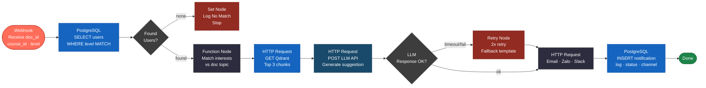
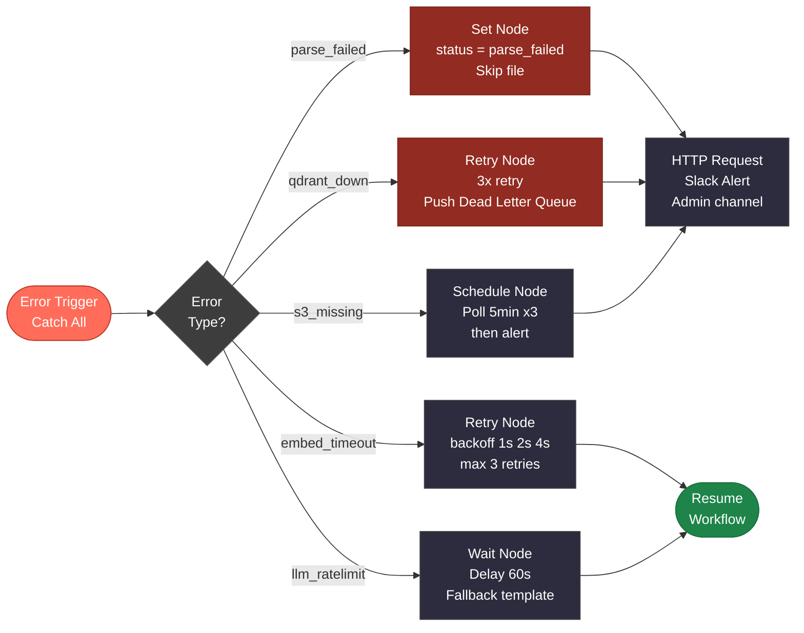
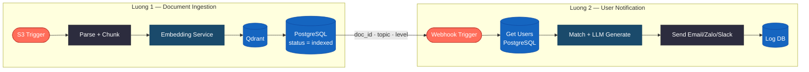

# B. Workflow Tự Động Hóa — AI Agent với n8n

Workflow tự động hóa toàn bộ quy trình: từ khi có **tài liệu mới trên S3** → index vào RAG → match với user profile → **gửi gợi ý học cá nhân hóa** đến người dùng.

Công cụ: **n8n** self-hosted, kết hợp các service từ Phần A.

---

## 1. Luồng 1 — Document Ingestion Workflow

```mermaid
flowchart LR

classDef trigger   fill:#FF6D5A,stroke:#c0392b,color:#fff
classDef action    fill:#2c2c3e,stroke:#444,color:#fff
classDef condition fill:#3d3d3d,stroke:#555,color:#fff
classDef service   fill:#1a4a6b,stroke:#0d3b57,color:#fff
classDef db        fill:#1565C0,stroke:#0d47a1,color:#fff
classDef error     fill:#922b21,stroke:#7b241c,color:#fff
classDef done      fill:#1e8449,stroke:#196f3d,color:#fff

T1([S3 Event\nTrigger]):::trigger

T1 --> V1{Validate\nFile?}:::condition

V1 -- invalid --> ERR1[Log Error\nAlert Admin]:::error
V1 -- valid --> S1[AWS S3\nDownload File]:::service

S1 --> SW{Switch\nFile Type}:::condition

SW -- PDF --> P1[HTTP Request\nPOST /parse PDF]:::action
SW -- Transcript --> P2[Function Node\nClean Transcript]:::action
SW -- Text --> P3[Set Node\nLoad Text]:::action

P1 --> META[Set Node\nAdd Metadata\ntopic · level · doc_id · date]:::action
P2 --> META
P3 --> META

META --> CHUNK[HTTP Request\nPOST /chunk\n512-1024 tokens]:::action

CHUNK --> EMBED[HTTP Request\nPOST /embed\nEmbedding Service]:::service

EMBED --> V2{Embedding\nOK?}:::condition

V2 -- fail --> ERR2[Retry Node\n3x backoff\nDead Letter Queue]:::error
V2 -- ok --> QDRANT[HTTP Request\nPUT Qdrant\nupsert vector]:::db

QDRANT --> PGUPDATE[PostgreSQL\nUPDATE status\nindexed_at = now]:::db

PGUPDATE --> WH_OUT([Webhook\nTrigger Flow 2]):::trigger
```

---

## 2. Luồng 2 — User Notification Workflow

---

## 3. Error Handling Workflow

---

## 4. Node Map — Các node n8n sử dụng

| Node | Loại n8n | Vai trò |
|---|---|---|
| S3 Event Trigger | S3 Trigger | Nhận event file mới upload |
| Validate File | IF Node | Kiểm tra định dạng, size |
| AWS S3 Download | AWS S3 Node | Tải file về workflow |
| Switch File Type | Switch Node | Phân nhánh PDF / Transcript / Text |
| Parse PDF | HTTP Request | Gọi Document Service `/parse` |
| Clean Transcript | Function Node | Loại bỏ timestamp, nhiễu |
| Add Metadata | Set Node | Gán topic, level, doc_id, upload_date |
| Chunking | HTTP Request | Gọi Document Service `/chunk` |
| Embedding | HTTP Request | Gọi Embedding Service `/embed` |
| Upsert Qdrant | HTTP Request | PUT vector + metadata vào Qdrant |
| Update DB | PostgreSQL Node | UPDATE documents SET status = indexed |
| Trigger Flow 2 | Webhook Node | Kích hoạt luồng notification |
| Get Users | PostgreSQL Node | SELECT user phù hợp level + interests |
| Match User | Function Node | So sánh interests với topic tài liệu |
| Get Chunks | HTTP Request | GET top 3 chunks từ Qdrant |
| Call LLM | HTTP Request | POST tới LLM API tạo gợi ý |
| Send Notify | HTTP Request | Gọi Email / Zalo OA / Slack API |
| Log Notification | PostgreSQL Node | INSERT log vào DB |
| Retry Node | Retry on Fail | Exponential backoff tự động |
| Error Trigger | Error Trigger | Bắt lỗi toàn workflow |

---

## 5. Tổng hợp 2 luồng

