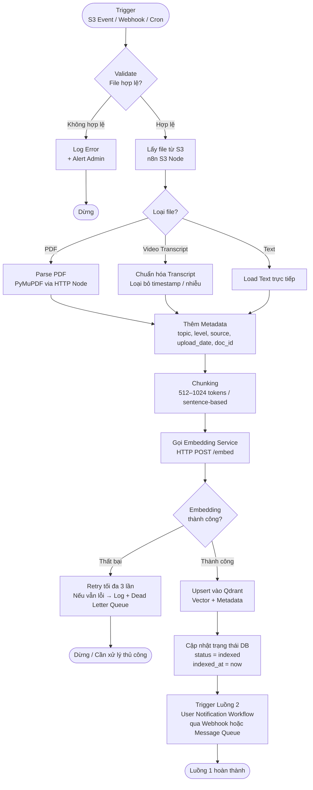
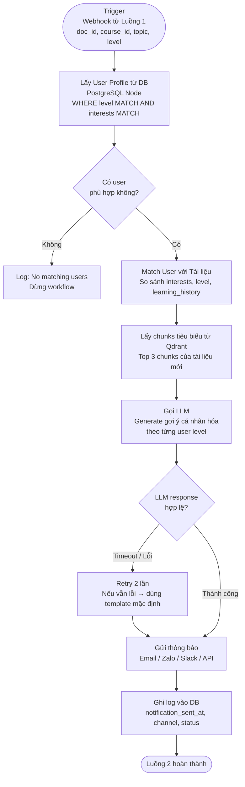
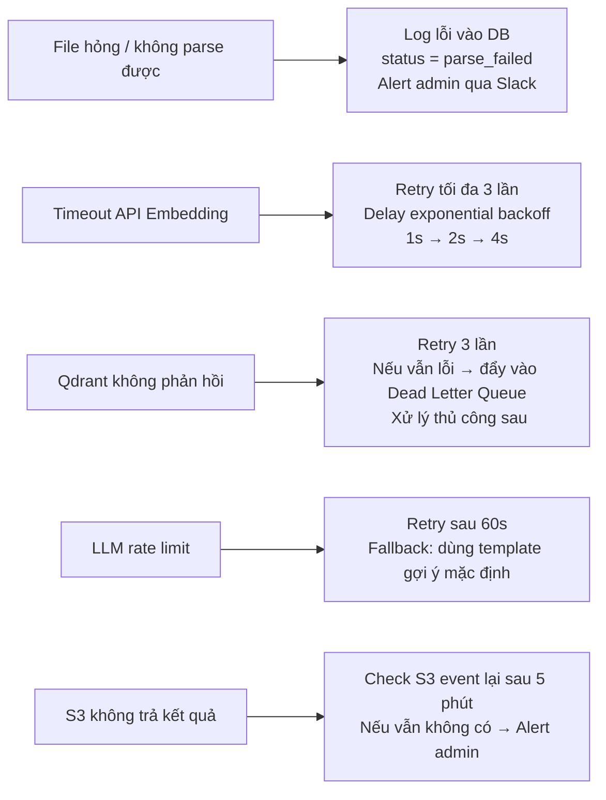
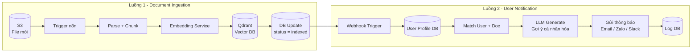

# B. Workflow Tự Động Hóa — AI Agent với n8n

Workflow tự động hóa toàn bộ quy trình: từ khi có **tài liệu mới trên S3** → index vào RAG → match với user profile → **gửi gợi ý học cá nhân hóa** đến người dùng.

Công cụ sử dụng: **n8n** (self-hosted hoặc cloud), kết hợp với các service từ Phần A.

---

## 1. Tổng quan kiến trúc Workflow

Workflow gồm **2 luồng chính** chạy độc lập:

| Luồng | Tên | Mục đích |
|---|---|---|
| Luồng 1 | Document Ingestion Workflow | Xử lý tài liệu mới từ S3 → index RAG |
| Luồng 2 | User Notification Workflow | Match user → gửi gợi ý học |

---

## 2. Luồng 1 — Document Ingestion Workflow

### Mô tả

Khi có file PDF hoặc video transcript mới được upload lên S3, hệ thống tự động kích hoạt pipeline xử lý, tách text, chuẩn hóa, và đưa vào RAG để index.

### Workflow Diagram



### Các node n8n chính

| Bước | n8n Node | Mô tả |
|---|---|---|
| Trigger | S3 Trigger / Webhook / Schedule | Nhận event file mới |
| Lấy file | AWS S3 Node (Download) | Tải file từ S3 |
| Parse PDF | HTTP Request Node | Gọi Document Service `/parse` |
| Metadata | Set Node | Gán topic, level, source, upload_date |
| Chunking | HTTP Request Node | Gọi Document Service `/chunk` |
| Embedding | HTTP Request Node | Gọi Embedding Service `/embed` |
| Upsert Vector | HTTP Request Node | Gọi Qdrant REST API `/upsert` |
| Cập nhật DB | PostgreSQL Node | UPDATE documents SET status = 'indexed' |
| Trigger Luồng 2 | Webhook / RabbitMQ Node | Kích hoạt notification workflow |

---

## 3. Luồng 2 — User Notification Workflow

### Mô tả

Sau khi tài liệu được index xong, hệ thống tự động lấy user profile từ DB, tính độ tương đồng giữa nội dung tài liệu và sở thích người dùng, sau đó gửi gợi ý học cá nhân hóa.

### Workflow Diagram



### Các node n8n chính

| Bước | n8n Node | Mô tả |
|---|---|---|
| Trigger | Webhook Node | Nhận doc_id, topic, level từ Luồng 1 |
| Lấy User | PostgreSQL Node | SELECT users WHERE level và interests phù hợp |
| Match | Function Node (JS) | So sánh interests với topic của tài liệu |
| Lấy Chunks | HTTP Request Node | GET Qdrant top 3 chunks của doc_id |
| Gọi LLM | HTTP Request Node | POST tới LLM API để generate gợi ý |
| Gửi Email | Gmail / SMTP Node | Gửi email thông báo |
| Gửi Zalo/Slack | HTTP Request Node | Gọi Zalo OA API hoặc Slack Webhook |
| Log DB | PostgreSQL Node | INSERT notification log |

---

## 4. Xử lý lỗi (Error Handling)



### Bảng tóm tắt xử lý lỗi

| Loại lỗi | Chiến lược xử lý |
|---|---|
| File hỏng / không parse được | Log + alert admin, skip file, đánh dấu `status = parse_failed` |
| Timeout API (Embedding / LLM) | Retry exponential backoff (1s → 2s → 4s), tối đa 3 lần |
| Rate limit LLM | Retry sau 60s, fallback về template gợi ý mặc định |
| Qdrant không phản hồi | Retry 3 lần → Dead Letter Queue → xử lý thủ công |
| S3 không trả kết quả | Poll lại sau 5 phút, tối đa 3 lần → alert admin |
| Không có user phù hợp | Log + dừng workflow, không gửi thông báo thừa |

---

## 5. Nội dung thông báo gửi tới User

Thông báo được cá nhân hóa theo `level` và `interests` của từng user.

### Ví dụ nội dung Email / Zalo

```
Chào [Tên User],

Tài liệu mới phù hợp với bạn vừa được thêm vào WeUpBook 🎉

📚 Tài liệu: Python Basics — Variables & Data Types
📌 Chủ đề: Python, Lập trình cơ bản
🎯 Phù hợp với trình độ: Beginner

💡 Gợi ý học:
Tài liệu này phù hợp với lịch sử học của bạn.
Bạn đã hoàn thành "Nhập môn lập trình" — đây là bước tiếp theo lý tưởng!

🔗 Xem tài liệu: https://weupbook.vn/docs/python-basics
⬇️ Tải xuống: https://s3.../python-basics.pdf

Chúc bạn học tốt!
WeUpBook Team
```

---

## 6. Sơ đồ tổng hợp 2 Luồng



---

## 7. Tại sao chọn n8n?

| Tiêu chí | n8n |
|---|---|
| Self-hosted | ✅ Kiểm soát dữ liệu hoàn toàn |
| Kết nối S3 | ✅ AWS S3 Node có sẵn |
| Kết nối PostgreSQL / MongoDB | ✅ Node có sẵn |
| HTTP Request linh hoạt | ✅ Gọi bất kỳ API nào (Embedding, Qdrant, LLM) |
| Error handling | ✅ Retry, Error Workflow, Dead Letter |
| Webhook trigger | ✅ Kích hoạt giữa các workflow |
| Monitoring | ✅ Execution log tích hợp sẵn |
| Chi phí | ✅ Miễn phí (self-hosted) |

---

## Kết luận Phần B

Workflow tự động hóa với n8n bao gồm:

- **Luồng 1** tự động nhận tài liệu từ S3, parse, chunk, embed và index vào Qdrant
- **Luồng 2** match user profile với nội dung tài liệu, gọi LLM tạo gợi ý cá nhân hóa và gửi thông báo
- **Xử lý lỗi** đầy đủ với retry, fallback và dead letter queue
- **Thông báo cá nhân hóa** theo level và sở thích của từng người dùng

Toàn bộ workflow có thể triển khai **không cần code**, chỉ cần cấu hình nodes trong n8n — phù hợp để **mở rộng nhanh** khi số lượng tài liệu và người dùng tăng cao.
