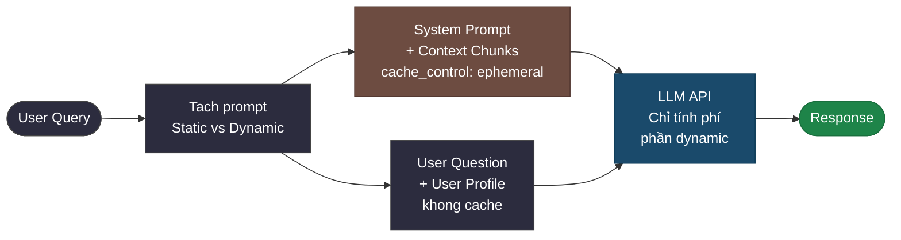
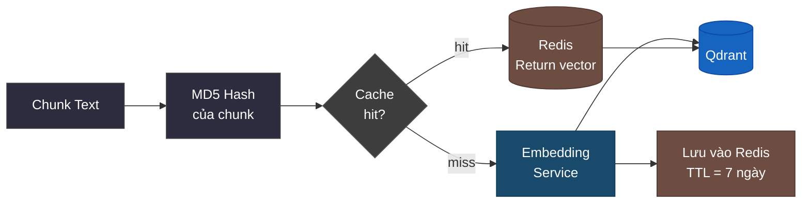
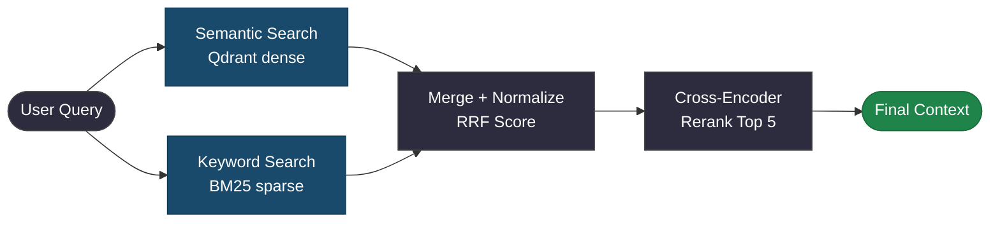
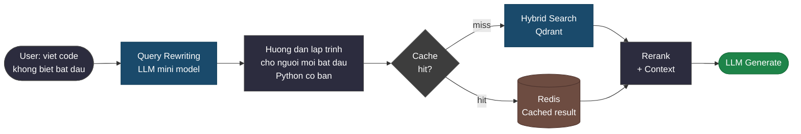
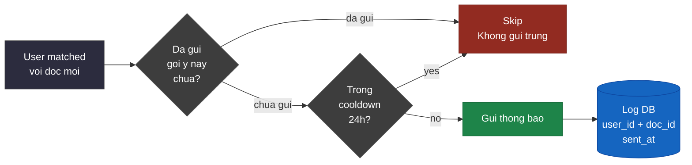
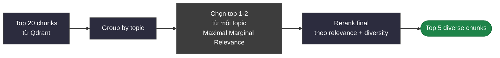
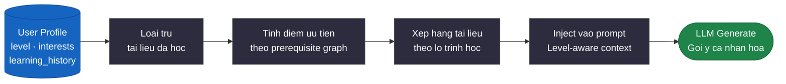
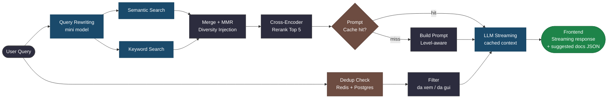

# C. Tối Ưu Hệ Thống (Optimization)

Phần này trình bày các chiến lược tối ưu khi hệ thống mở rộng với **nhiều user và tài liệu**, tập trung vào 3 mục tiêu:

- Giảm chi phí token LLM
- Tăng tốc độ phản hồi
- Tránh gợi ý trùng lặp, quá chung chung nhưng vẫn cá nhân hóa

---

## 1. Tối ưu chi phí token

### 1.1 Prompt Caching

Phần System Prompt và Context tài liệu thường **lặp lại giữa các request**. Sử dụng **Prompt Caching** (Anthropic / OpenAI) để cache phần tĩnh, chỉ tính phí phần động.



Kết quả: giảm **60–80% chi phí token** cho các câu hỏi cùng tài liệu.

---

### 1.2 Vector Cache — Tránh Embedding Trùng Lặp

Trước khi gọi Embedding Service, kiểm tra cache. Nếu chunk đã được embed rồi thì dùng lại.



Áp dụng: **Redis** làm vector cache với key = `md5(chunk_text)`.

---

### 1.3 Batching Embedding Request

Thay vì gọi API từng chunk một, gom nhiều chunk vào 1 request.

| Cách | Số API call cho 100 chunks |
|---|---|
| Gọi tuần tự | 100 calls |
| Batch size = 32 | 4 calls |
| Tiết kiệm | 96% số lượng request |

---

### 1.4 Chọn Model Phù Hợp Theo Task

Không phải task nào cũng cần model lớn.

| Task | Model đề xuất | Lý do |
|---|---|---|
| Phân loại câu hỏi (Router) | claude-haiku / gpt-4o-mini | Đơn giản, cần nhanh |
| Tóm tắt gợi ý tài liệu | claude-haiku / gpt-4o-mini | Output ngắn |
| Trả lời câu hỏi phức tạp | claude-sonnet / gpt-4o | Cần chất lượng cao |
| Reranking | Cross-encoder nhỏ (local) | Không cần gọi LLM API |

---

## 2. Tối ưu tốc độ phản hồi

### 2.1 Streaming Response

Thay vì chờ LLM trả toàn bộ output, dùng **streaming** để frontend hiển thị từng token ngay khi có.


Cảm nhận tốc độ tăng đáng kể dù latency thực tế không đổi.

---

### 2.2 Parallel Retrieval

Thực hiện Semantic Search và Keyword Search **song song** thay vì tuần tự.



Giảm latency retrieval từ ~400ms xuống ~200ms (chạy song song với `asyncio.gather`).

---

### 2.3 Query Rewriting

Câu hỏi ngắn hoặc mơ hồ của user thường cho retrieval kém. Rewrite trước khi search.



---

### 2.4 Kết quả tổng hợp tối ưu tốc độ

| Kỹ thuật | Tác động |
|---|---|
| Streaming | Thời gian đến token đầu tiên giảm ~70% |
| Parallel retrieval | Latency retrieval giảm ~50% |
| Query rewriting | Chất lượng context tăng, giảm hallucination |
| Vector cache (Redis) | Cache hit loại bỏ hoàn toàn embedding latency |

---

## 3. Tránh gợi ý trùng lặp và cá nhân hóa

### 3.1 Notification Deduplication

Trước khi gửi gợi ý, kiểm tra user đã nhận tài liệu này chưa.



Logic kiểm tra trong PostgreSQL:

```sql
SELECT 1 FROM notification_log
WHERE user_id = $1
  AND doc_id  = $2
  AND sent_at > NOW() - INTERVAL '7 days'
LIMIT 1;
```

---

### 3.2 Diversity Injection — Tránh Gợi Ý Quá Giống Nhau

Khi gợi ý nhiều tài liệu, đảm bảo **đa dạng chủ đề** thay vì chỉ gợi ý cùng 1 topic.



Công thức **MMR (Maximal Marginal Relevance)**:

```
MMR_score = λ · relevance(chunk, query)
          - (1-λ) · max_similarity(chunk, selected_chunks)

λ = 0.7  →  ưu tiên relevance
λ = 0.5  →  cân bằng relevance và diversity
```

---

### 3.3 Cá Nhân Hóa Theo Lịch Sử Học

Dùng `learning_history` của user để **lọc nội dung đã học** và **ưu tiên nội dung tiếp theo**.



Ví dụ scoring logic:

```
priority_score =
  0.4 · semantic_similarity(doc, user_interests)
+ 0.3 · prerequisite_match(doc, completed_courses)
+ 0.2 · level_match(doc.level, user.level)
+ 0.1 · recency_boost(doc.upload_date)
```

---

### 3.4 Level-Aware Prompt — Tránh Trả Lời Quá Chung Chung

Prompt được điều chỉnh chặt theo `user.level` để tránh output generic.

```
System Prompt (Beginner):
  - Giai thich bang vi du thuc te, tranh thuat ngu ky thuat
  - Moi khai niem can co 1 vi du code cu the
  - Gioi han do dai: ngan gon, de hieu
  - KHONG duoc: giai thich truu tuong, bo qua buoc co ban

System Prompt (Intermediate):
  - Co the dung thuat ngu ky thuat, nhung can giai thich ngan
  - Tap trung vao best practice va common pitfalls
  - So sanh cac cach tiep can khac nhau

System Prompt (Advanced):
  - Di thang vao van de, khong giai thich co ban
  - Tap trung vao edge cases, performance, trade-off
  - Trich dan nguon tham khao neu co
```

---

## 4. Tổng hợp chiến lược tối ưu



---

## Kết luận Phần C

| Mục tiêu | Kỹ thuật | Kết quả kỳ vọng |
|---|---|---|
| Giảm chi phí token | Prompt Caching + Batching + Model routing | Giảm 60-80% chi phí LLM |
| Tăng tốc phản hồi | Streaming + Parallel retrieval + Vector cache | Latency giảm 50%, TTFT giảm 70% |
| Tránh trùng lặp | Deduplication log + Cooldown window | Loại bỏ 100% gợi ý đã gửi |
| Cá nhân hóa sâu | MMR + Priority scoring + Level-aware prompt | Gợi ý phù hợp lo trinh, không generic |
