# BÀI TEST: THIẾT KẾ HỆ THỐNG RAG + AUTOMATION
---

## A. Thiết kế RAG + Gợi ý học

### 1. Sơ đồ RAG tổng quan (Microservices)

Hệ thống được thiết kế theo kiến trúc microservices với 3 service chính, tương tác qua các event và API.

```mermaid
flowchart TD
    %% Styles
    classDef s3 fill:#F9E79F,stroke:#B7950B,stroke-width:2px
    classDef db fill:#AED6F1,stroke:#1F618D,stroke-width:2px
    classDef service fill:#F5B7B1,stroke:#C0392B,stroke-width:2px,color:black
    classDef external fill:#D7BDE2,stroke:#7D3C98,stroke-width:2px
    classDef vector fill:#A9DFBF,stroke:#196F3D,stroke-width:2px

    %% Data Sources
    S3[("<b>S3 Bucket</b><br/>PDF / Transcript / Text")]:::s3
    UserDB[("<b>User DB</b><br/>PostgreSQL/MongoDB")]:::db

    %% Trigger Flow
    S3 -- "Event (SQS/SNS)" --> DocService

    %% Document Processing Service
    subgraph DocService [<b>Document Processing Service</b>]
        direction TB
        P1["Parse & Extract Text"] --> P2["Chunking & Cleaning"]
        P2 --> P3["Metadata Enrichment<br/>(topic, level, source, doc_id, date)"]
        P3 --> P4["Call Embedding Service"]
    end
    class DocService service

    %% Embedding Service
    subgraph EmbedService [<b>Embedding Service</b>]
        E1["Generate Embeddings"]
    end
    class EmbedService service

    %% Vector DB
    VectorDB[("<b>Vector DB</b><br/>Pinecone / Qdrant / Milvus")]:::vector

    %% Assistant Service
    subgraph AssistantService [<b>Assistant Service</b>]
        direction TB
        A1["Receive Query (question, user_id)"] --> A2["Get User Profile<br/>from UserDB"]
        A2 --> A3["Query Vector DB<br/>(with filters)"]
        A3 --> A4["Retrieve Top-K Chunks"]
        A4 --> A5["Construct Dynamic Prompt<br/>(with user level & history)"]
        A5 --> A6["Call LLM (OpenAI/Claude)"]
        A6 --> A7["Post-Process: Format Response &<br/>Aggregate Source Documents"]
    end
    class AssistantService service

    %% External LLM
    LLM[("<b>LLM API</b><br/>GPT-4 / Claude)"]:::external

    %% User Interaction
    User(("<b>User</b>")):::external

    %% Connections
    DocService --> EmbedService
    EmbedService --> VectorDB
    
    User -- "Câu hỏi" --> AssistantService
    AssistantService --> UserDB
    AssistantService --> VectorDB
    AssistantService --> LLM
    AssistantService -- "Trả lời + Gợi ý" --> User

    %% Data flow for indexing
    VectorDB -.-> DocService
```

### 2. Giải thích chiến lược xử lý dữ liệu và Prompt

#### a) Chiến lược Chunk Size và Metadata

| Thành phần | Chiến lược | Lý do |
| :--- | :--- | :--- |
| **Chunk Size** | **512 - 1024 tokens** (có overlap ~10-15%) | - Đủ lớn để chứa một ý hoàn chỉnh trong tài liệu học.<br>- Đủ nhỏ để tập trung vào một chủ đề, tăng độ chính xác khi truy vấn và phù hợp với context window của LLM.<br>- Overlap giúp không bị mất ngữ cảnh ở biên giữa các chunk. |
| **Metadata (Document Level)** | `doc_id`, `source` (S3 URI), `title`, `upload_date`, `course_id` | Dùng để truy xuất nguồn, tạo link, hiển thị thông tin tài liệu gốc cho user. |
| **Metadata (Chunk Level)** | `topic` (chủ đề con), `level` (beginner/intermediate), `page_number` (nếu là PDF) | - **`level`**: Lọc vector search ngay từ đầu, chỉ lấy các chunk phù hợp với trình độ user, tránh gợi ý sai level.<br>- **`topic`**: Giúp gom nhóm các chunk liên quan và cá nhân hóa theo sở thích. |

#### b) Thiết kế Prompt (Cá nhân hóa và Tránh chung chung)

Prompt được thiết kế động, bao gồm 3 phần chính:

1.  **System Prompt (Vai trò và Quy tắc):**
    ```text
    Bạn là một trợ lý học tập thông minh cho nền tảng WeupBook. Nhiệm vụ của bạn là trả lời câu hỏi của người dùng DỰA TRÊN các đoạn tài liệu được cung cấp (ngữ cảnh) và ĐƯA RA gợi ý tài liệu cụ thể.

    QUY TẮC QUAN TRỌNG:
    1.  TRẢ LỜI DỰA TRÊN NGỮ CẢNH: Chỉ sử dụng thông tin trong phần <context> để trả lời. Nếu câu trả lời không có trong ngữ cảnh, hãy nói "Tôi không tìm thấy thông tin này trong tài liệu hiện có."
    2.  PHÂN BIỆT TRÌNH ĐỘ: Người dùng hiện tại có trình độ {{user_level}}. Hãy điều chỉnh cách giải thích cho phù hợp (ví dụ: dùng ví dụ đơn giản cho Beginner, đi sâu vào thuật ngữ chuyên ngành cho Intermediate).
    3.  GỢI Ý CỤ THỂ: Ở cuối câu trả lời, luôn liệt kê các tài liệu nguồn bạn đã dùng (kèm tên, chủ đề, link) và gợi ý 1-2 tài liệu liên quan khác từ ngữ cảnh.
    4.  TRÁNH CHUNG CHUNG: Không đưa ra kiến thức nền tảng không có trong tài liệu. Câu trả lời phải bám sát nội dung học.
    ```

2.  **Context (Kết quả từ Vector DB):**
    ```text
    <context>
    [1] [Tài liệu: Nhập môn Python, Level: Beginner, Chủ đề: Biến]
    Nội dung: Biến trong Python giống như một cái hộp để lưu trữ giá trị. Bạn có thể đặt tên cho nó và gán dữ liệu bằng dấu '='. Ví dụ: ten_sinh_vien = "An" sẽ lưu chữ "An" vào biến ten_sinh_vien.
    
    [2] [Tài liệu: Lập trình hướng đối tượng, Level: Intermediate, Chủ đề: Class]
    Nội dung: Class là một bản thiết kế (blueprint) để tạo ra các đối tượng (object). Nó định nghĩa các thuộc tính (attribute) và phương thức (method) mà đối tượng sẽ có. Ví dụ: class SinhVien: def __init__(self, ten): self.ten = ten
    ...
    </context>
    ```

3.  **User Query:**
    ```text
    Câu hỏi của người dùng (trình độ {{user_level}}, sở thích {{user_interests}}): {{user_question}}
    ```

## B. Workflow Tự động hóa với n8n

### 1. Sơ đồ Workflow chi tiết (n8n)

Hệ thống sử dụng **n8n** để tự động hóa toàn bộ quy trình từ khi có tài liệu mới đến khi gửi thông báo cho người dùng.

```mermaid
flowchart LR
    subgraph Trigger [Trigger & Input]
        A[("S3 Bucket<br/>New File Upload")] --> B["n8n Trigger:<br/>S3 'New File' Event"]
        B --> C["Get File Metadata<br/>(Bucket, Key, Size)"]
    end

    subgraph Process [Xử lý & Index]
        D["Download File from S3"]
        E{"File Type?"}
        F["Parse PDF"]
        G["Transcribe Audio/Video<br/>(if needed, or get transcript)"]
        H["Extract & Clean Text"]
        I["Chunking & Add Metadata<br/>(level, topic, doc_id)"]
        J["Generate Embeddings<br/>(via HTTP Request node)"]
        K["Upsert to Vector DB<br/>(via HTTP Request node)"]
    end

    subgraph Notification [Cá nhân hóa & Gửi thông báo]
        L["Fetch Active Users<br/>from DB (PostgreSQL node)"]
        M["For each user:<br/>Call Matching Logic"]
        N["Get User Profile<br/>(level, interests, history)"]
        O["Query Vector DB<br/>for relevant new doc chunks<br/>(filter by user level & topic)"]
        P{"Has new relevant<br/>content?"}
        Q["Generate Notification Content<br/>via LLM (optional)"]
        R["Send Notification<br/>(Email/Slack node)"]
    end

    %% Connections for Process
    C --> D
    D --> E
    E -- "PDF" --> F --> H
    E -- "Video/Audio" --> G --> H
    E -- "Text" --> H
    H --> I --> J --> K

    %% Connections for Notification
    K --> L
    L --> M
    M --> N
    N --> O
    O --> P
    P -- "Yes" --> Q --> R
    P -- "No" --> End[("End<br/>(No notification)")]
    
    classDef storage fill:#F9E79F,stroke:#B7950B;
    classDef n8n fill:#A9DFBF,stroke:#196F3D;
    classDef db fill:#AED6F1,stroke:#1F618D;
    classDef decision fill:#F5B7B1,stroke:#C0392B;
    
    class A,K storage;
    class B,C,D,F,G,H,I,J,M,O,P,R n8n;
    class L,N db;
    class E,P decision;
```



### 2. Xử lý lỗi (Error Handling)

1.  **Lỗi File hỏng / Không parse được:**
    - **Bước phát hiện:** Trong node "Parse PDF" hoặc "Extract Text", nếu có exception hoặc output rỗng.
    - **Xử lý:**
        - Ghi log lỗi chi tiết (file name, bucket, lỗi) vào một bảng `error_logs` trong DB hoặc file log riêng.
        - Gửi thông báo (Slack/Email) đến admin hệ thống với nội dung: `[ERROR] Không thể xử lý file: {file_name}. Lỗi: {error_message}. Cần kiểm tra thủ công.`
        - **Dừng workflow cho file này** (không index và không gửi thông báo).

2.  **Lỗi Timeout / Rate Limit từ API bên ngoài (Embedding, LLM):**
    - **Bước phát hiện:** HTTP Request node trả về mã lỗi 429 (Rate Limit) hoặc timeout.
    - **Xử lý:**
        - Sử dụng tính năng **Retry** của n8n (ví dụ: thử lại tối đa 3 lần, với thời gian chờ tăng dần: 1s, 5s, 15s).
        - Nếu vẫn thất bại sau 3 lần, ghi log và đánh dấu tài liệu đó có trạng thái "indexing_failed".
        - Đối với rate limit, có thể thêm một node `Wait` phía trước để làm chậm tốc độ gửi request.

3.  **Lỗi S3 không trả kết quả / Mạng:**
    - **Bước phát hiện:** Node trigger S3 không nhận được event hoặc node download file bị lỗi kết nối.
    - **Xử lý:**
        - Cấu hình S3 event gửi vào một **Dead Letter Queue (DLQ)** của SQS. Nếu sau nhiều lần thử xử lý event không thành công, nó sẽ được chuyển vào DLQ để admin có thể xem xét và xử lý lại sau.
        - Workflow n8n nên được thiết kế để bắt lỗi kết nối và gửi cảnh báo tới team kỹ thuật.

## C. Đề xuất Tối ưu (Không bắt buộc)

1.  **Tối ưu chi phí Token và Tốc độ:**
    - **Hybrid Search:** Kết hợp Vector Search (tìm theo ngữ nghĩa) với Keyword Search (tìm theo từ khóa, dùng BM25). Điều này giúp giảm số lượng chunk cần lấy từ vector DB (top-K nhỏ hơn) mà vẫn đảm bảo độ chính xác, từ đó giảm số token đưa vào LLM.
    - **Caching:** Sử dụng Redis để cache kết quả cho các câu hỏi giống nhau hoặc tương tự từ nhiều user. Đặc biệt hiệu quả với các tài liệu phổ biến.
    - **Reranking:** Thay vì lấy 10 chunk và cho tất cả vào prompt, hãy lấy 20-30 chunk, sau đó dùng một mô hình Reranker nhỏ để chọn ra 5-7 chunk chất lượng nhất. Giảm nhiễu và tiết kiệm token.
    - **Prompt Cache:** Một số nhà cung cấp LLM (ví dụ: Gemini) hỗ trợ prompt caching. Nếu phần system prompt và context dài, việc cache sẽ giảm đáng kể chi phí và thời gian xử lý.

2.  **Tránh gợi ý trùng lặp và cá nhân hóa:**
    - **Đa dạng hóa (MMR):** Khi query vector DB, sử dụng thuật toán **Maximum Marginal Relevance (MMR)**. Thuật toán này vừa tìm các chunk *liên quan* nhất, vừa đảm bảo chúng *khác nhau* về nội dung, tránh việc lấy toàn bộ các chunk giống nhau từ một đoạn tài liệu.
    - **Lọc theo lịch sử:** Khi query vector DB để tìm tài liệu gợi ý, thêm filter loại trừ các `doc_id` mà user đã học hoặc đã được gợi ý trong 7 ngày gần nhất (lấy từ DB).
    - **Phân tích sở thích động:** Không chỉ dùng level và sở thích tĩnh từ profile, mà còn có thể phân tích lịch sử tương tác gần nhất của user (các câu hỏi gần đây, tài liệu họ xem nhiều) để tạo ra một "user embedding" tạm thời. Sau đó, dùng embedding này để tìm các tài liệu có nội dung tương tự.
