# PHẦN B: AUTOMATION WORKFLOW VỚI N8N

> **Hệ thống RAG + Automation cho WeupBook**  Triển khai với n8n  
> Kết hợp với kiến trúc microservices đã thiết kế ở Phần A

---

## Mục Lục

1. [Tổng quan N8N trong hệ thống](#1-tổng-quan-n8n-trong-hệ-thống)
2. [Workflow 1  Document Indexing Pipeline](#2-workflow-1--document-indexing-pipeline)
3. [Workflow 2  RAG Query & Response](#3-workflow-2--rag-query--response)
4. [Workflow 3  User Matching & Notification](#4-workflow-3--user-matching--notification)
5. [Workflow 4  Scheduled Re-indexing](#5-workflow-4--scheduled-re-indexing)
6. [Workflow 5  Error Handling & Alerting](#6-workflow-5--error-handling--alerting)
7. [N8N Node Configuration Chi tiết](#7-n8n-node-configuration-chi-tiết)
8. [Deployment N8N](#8-deployment-n8n)

---

## 1. Tổng quan N8N trong hệ thống

### N8N đóng vai trò **Automation Orchestrator**  thay thế code logic phức tạp bằng visual workflow

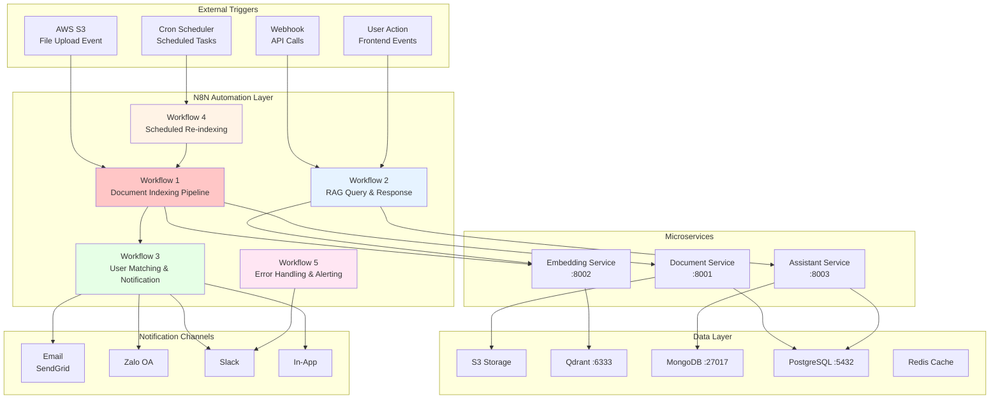

### Lý do chọn N8N

| Tiêu chí | N8N | Custom Code | Apache Airflow |
|----------|-----|-------------|----------------|
| **Setup time** |  Nhanh (visual) |  Chậm |  Chậm |
| **Self-hosted** |  Có |  Có |  Có |
| **HTTP integrations** |  Built-in | Manual | Manual |
| **Error handling** |  Visual retry | Manual code | DAG-based |
| **Cost** | Free (self-host) | Dev time | Dev time |
| **Webhook support** |  Native | Manual | Plugin |
| **AI nodes** |  LangChain built-in | Manual | Manual |

---

## 2. Workflow 1  Document Indexing Pipeline

> **Trigger**: S3 upload event  Index tài liệu vào Qdrant

### Sơ đồ tổng quan

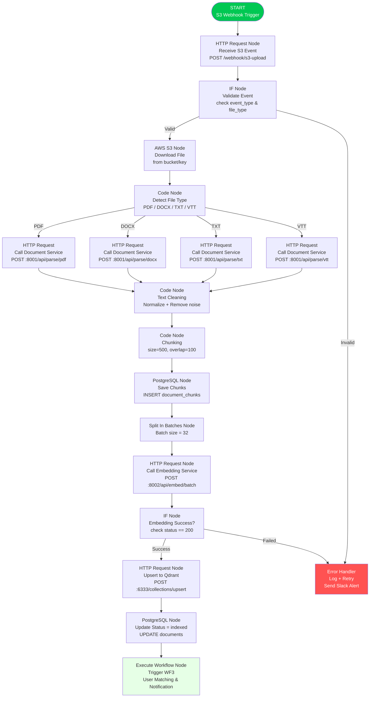

### Chi tiết từng node

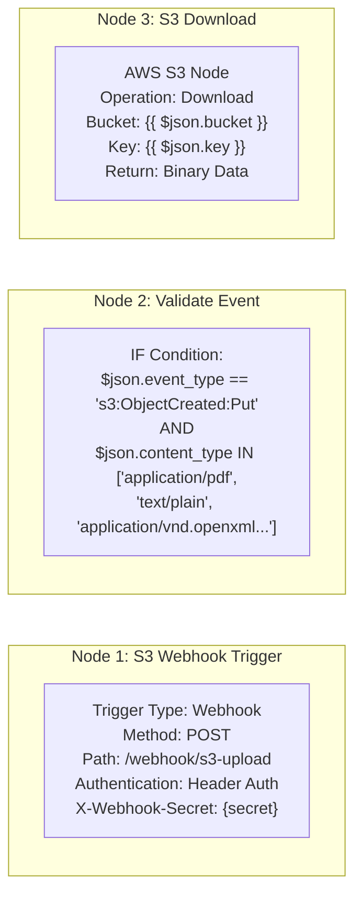

### N8N JSON Config (Node: Embedding Batch)

```json
{
  "name": "Call Embedding Service",
  "type": "n8n-nodes-base.httpRequest",
  "parameters": {
    "method": "POST",
    "url": "http://embedding-service:8002/api/embed/batch",
    "authentication": "genericCredentialType",
    "sendBody": true,
    "bodyParameters": {
      "parameters": [
        {
          "name": "texts",
          "value": "={{ $json.chunks.map(c => c.text) }}"
        },
        {
          "name": "normalize",
          "value": true
        }
      ]
    },
    "options": {
      "timeout": 30000,
      "retry": {
        "enabled": true,
        "maxTries": 3,
        "waitBetweenTries": 2000
      }
    }
  }
}
```

---

## 3. Workflow 2  RAG Query & Response

> **Trigger**: User gửi câu hỏi từ Frontend  Trả về Answer + Recommendations

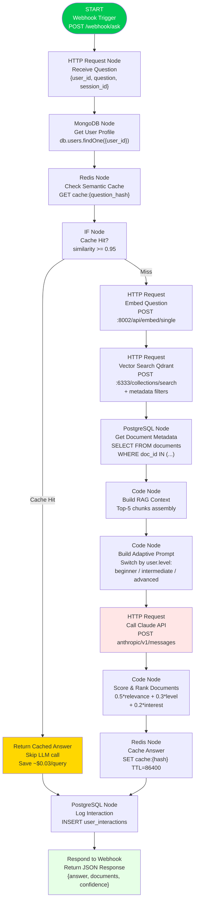

### Adaptive Prompt Builder  Code Node

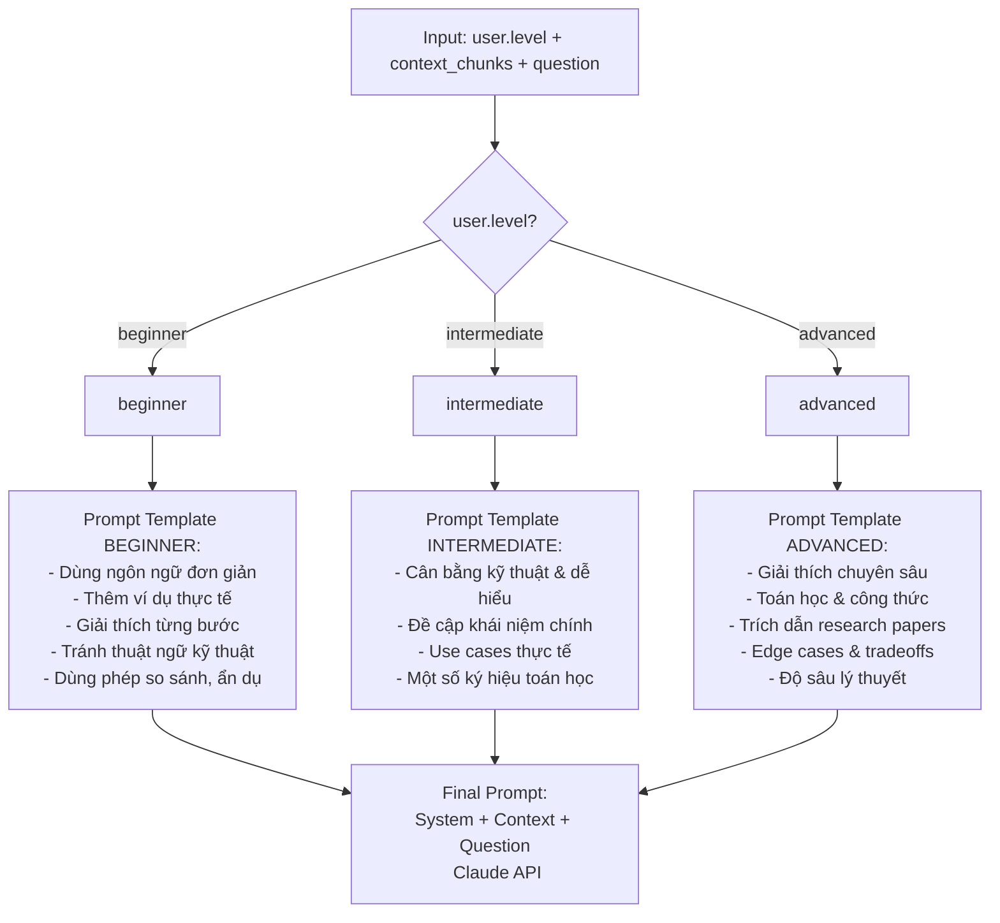

---

## 4. Workflow 3  User Matching & Notification

> **Trigger**: Sau khi document được index xong  Tìm users phù hợp  Gửi thông báo

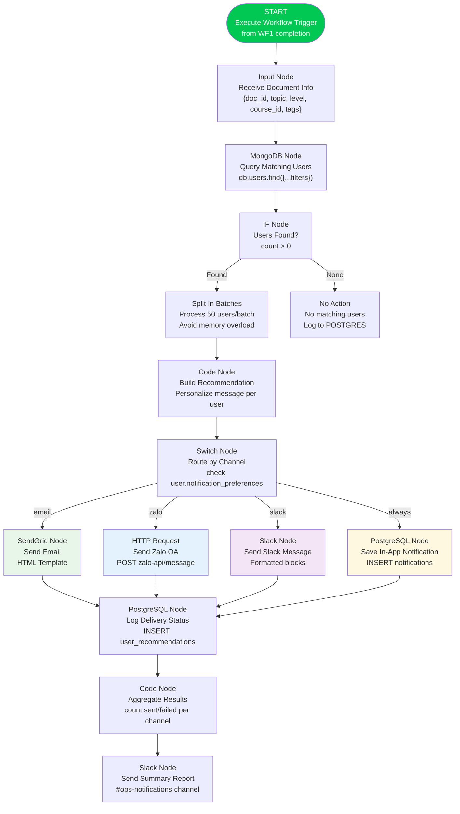

### MongoDB Query Node  Tìm Matching Users

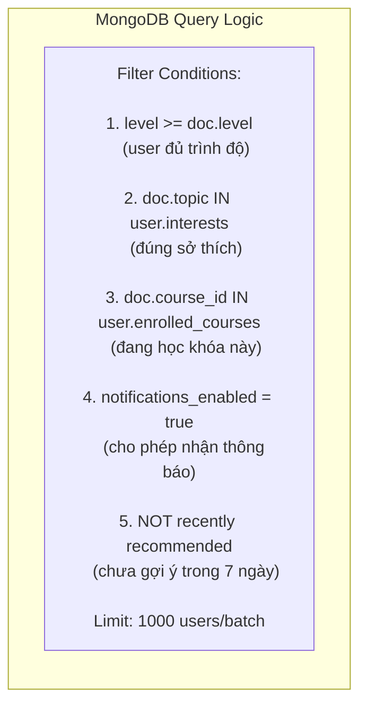

### Email Template Node (SendGrid)

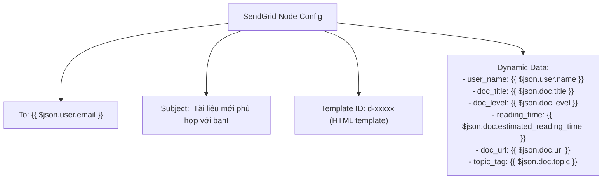

---

## 5. Workflow 4  Scheduled Re-indexing

> **Trigger**: Cron job hàng đêm  Kiểm tra & re-index tài liệu lỗi/cũ

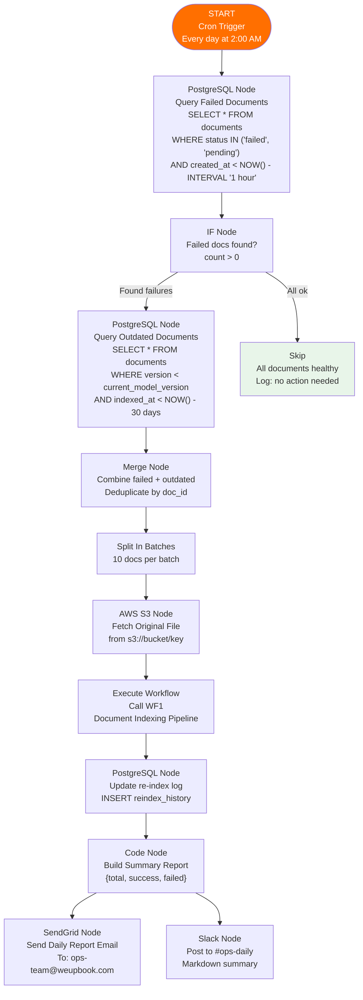

---

## 6. Workflow 5  Error Handling & Alerting

> **Trigger**: Bất kỳ workflow nào thất bại  Alert team + Auto retry

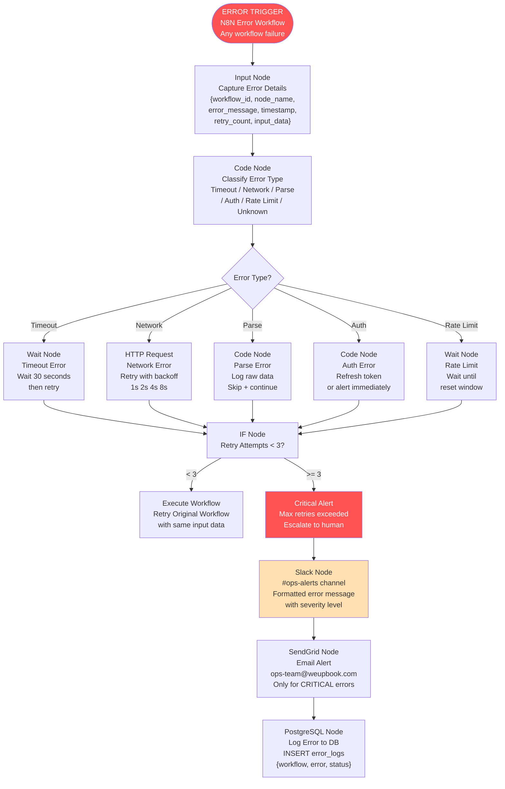

### Error Classification Matrix

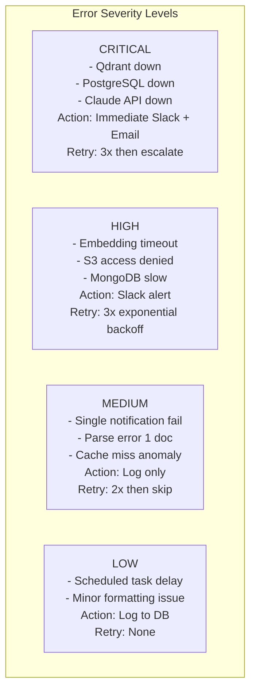

---

## 7. N8N Node Configuration Chi tiết

### Credential Setup trong N8N

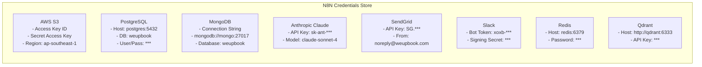

### Environment Variables cho N8N

```bash
# .env file cho N8N deployment

# N8N Core
N8N_HOST=0.0.0.0
N8N_PORT=5678
N8N_PROTOCOL=https
N8N_ENCRYPTION_KEY=your-32-char-secret-key

# Database (N8N internal)
DB_TYPE=postgresdb
DB_POSTGRESDB_HOST=postgres
DB_POSTGRESDB_PORT=5432
DB_POSTGRESDB_DATABASE=n8n
DB_POSTGRESDB_USER=n8n_user
DB_POSTGRESDB_PASSWORD=n8n_password

# Webhook
WEBHOOK_URL=https://n8n.weupbook.com
N8N_WEBHOOK_BASE_URL=https://n8n.weupbook.com/webhook

# Queue Mode (for scaling)
EXECUTIONS_MODE=queue
QUEUE_BULL_REDIS_HOST=redis
QUEUE_BULL_REDIS_PORT=6379
```

---

## 8. Deployment N8N

### Docker Compose  N8N Service

```yaml
version: "3.8"

services:
  #  N8N Automation Engine 
  n8n:
    image: n8nio/n8n:latest
    container_name: weupbook-n8n
    restart: always
    ports:
      - "5678:5678"
    environment:
      - N8N_HOST=0.0.0.0
      - N8N_PORT=5678
      - N8N_PROTOCOL=https
      - WEBHOOK_URL=https://n8n.weupbook.com
      - DB_TYPE=postgresdb
      - DB_POSTGRESDB_HOST=postgres
      - DB_POSTGRESDB_DATABASE=n8n_db
      - DB_POSTGRESDB_USER=${POSTGRES_USER}
      - DB_POSTGRESDB_PASSWORD=${POSTGRES_PASS}
      - N8N_ENCRYPTION_KEY=${N8N_ENCRYPTION_KEY}
      - EXECUTIONS_MODE=queue
      - QUEUE_BULL_REDIS_HOST=redis
    volumes:
      - n8n_data:/home/node/.n8n
      - ./n8n-workflows:/home/node/.n8n/workflows
    networks:
      - weupbook-network
    depends_on:
      - postgres
      - redis

  #  N8N Worker (for queue mode) 
  n8n-worker:
    image: n8nio/n8n:latest
    container_name: weupbook-n8n-worker
    restart: always
    command: worker
    environment:
      - EXECUTIONS_MODE=queue
      - QUEUE_BULL_REDIS_HOST=redis
      - DB_TYPE=postgresdb
      - DB_POSTGRESDB_HOST=postgres
      - DB_POSTGRESDB_DATABASE=n8n_db
      - N8N_ENCRYPTION_KEY=${N8N_ENCRYPTION_KEY}
    networks:
      - weupbook-network
    depends_on:
      - n8n
      - redis

volumes:
  n8n_data:

networks:
  weupbook-network:
    driver: bridge
```

### Kiến trúc Scaling N8N

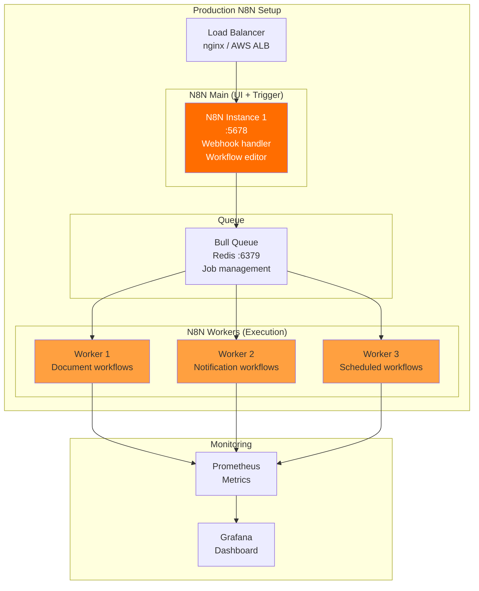

---

## Tổng kết: Workflow Integration Map

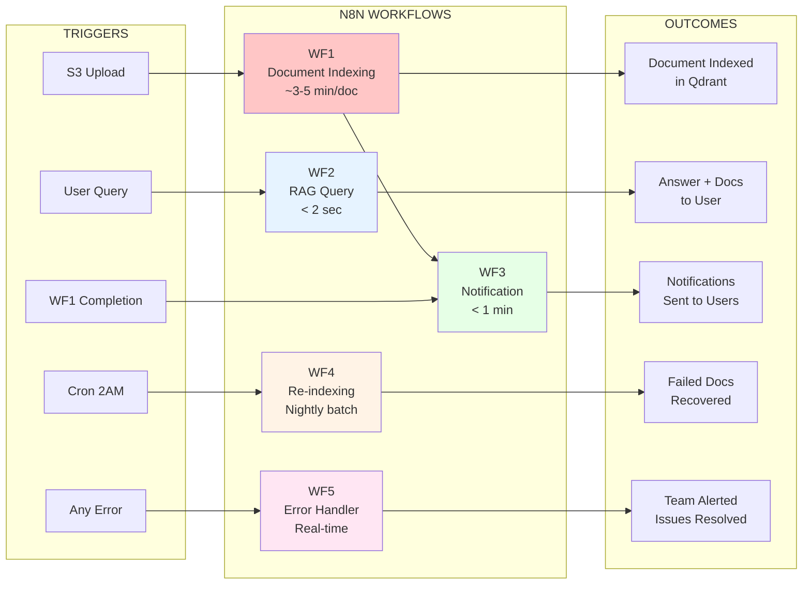

---

>  **Ghi chú**: Toàn bộ workflow N8N có thể export/import dưới dạng JSON và version-control trên Git. Mỗi workflow nên có documentation đi kèm và unit test với N8N's built-in execution history.
