# BÀI GIẢI — HỆ THỐNG RAG + AUTOMATION GỢI Ỳ TÀI LIỆU HỌC

**Vị trí**: AI Engineer (RAG & Automation)  
**Mục tiêu**: Thiết kế hệ thống gợi ý tài liệu thông minh cho WeupBook

---

## KIẾN TRÚC HỆ THỐNG MICROSERVICES

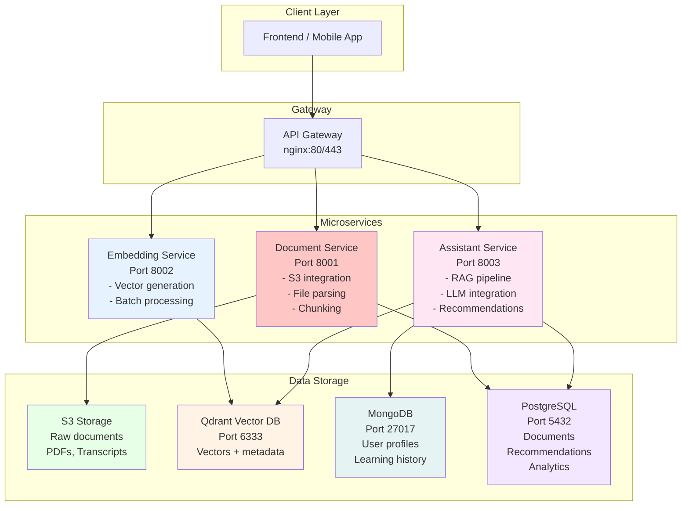
```mermaid
graph TB
    subgraph "Client Layer"
        WEB["Frontend / Mobile App"]
    end
    
    subgraph "Gateway"
        API["API Gateway<br/>nginx:80/443"]
    end
    
    subgraph "Microservices"
        DOC["Document Service<br/>Port 8001<br/>- S3 integration<br/>- File parsing<br/>- Chunking"]
        
        EMBED["Embedding Service<br/>Port 8002<br/>- Vector generation<br/>- Batch processing"]
        
        ASSIST["Assistant Service<br/>Port 8003<br/>- RAG pipeline<br/>- LLM integration<br/>- Recommendations"]
    end
    
    subgraph "Data Storage"
        S3["S3 Storage<br/>Raw documents<br/>PDFs, Transcripts"]
        
        QDRANT["Qdrant Vector DB<br/>Port 6333<br/>Vectors + metadata"]
        
        MONGO["MongoDB<br/>Port 27017<br/>User profiles<br/>Learning history"]
        
        POSTGRES["PostgreSQL<br/>Port 5432<br/>Documents<br/>Recommendations<br/>Analytics"]
    end
    
    WEB --> API
    API --> DOC
    API --> EMBED
    API --> ASSIST
    
    DOC --> S3
    DOC --> POSTGRES
    
    EMBED --> QDRANT
    
    ASSIST --> QDRANT
    ASSIST --> MONGO
    ASSIST --> POSTGRES
    
    style DOC fill:#FFC6C6
    style EMBED fill:#E6F3FF
    style ASSIST fill:#FFE6F3
    style S3 fill:#E6FFE6
    style QDRANT fill:#FFF3E6
    style MONGO fill:#E6F3F3
    style POSTGRES fill:#F3E6FF
```

---

## PHẦN A: RAG + GỢI Ỳ HỌC

### A.1. Sơ đồ RAG tổng quan

#### Flow 1: Indexing tài liệu từ S3 → Vector DB

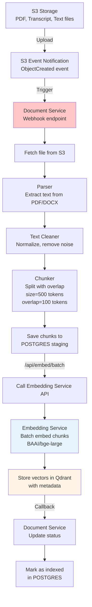
```mermaid
flowchart TD
    A["S3 Storage<br/>PDF, Transcript, Text files"]
    B["S3 Event Notification<br/>ObjectCreated event"]
    C["Document Service<br/>Webhook endpoint"]
    D["Fetch file from S3"]
    E["Parser<br/>Extract text from PDF/DOCX"]
    F["Text Cleaner<br/>Normalize, remove noise"]
    G["Chunker<br/>Split with overlap<br/>size=500 tokens<br/>overlap=100 tokens"]
    H["Save chunks to<br/>POSTGRES staging"]
    
    I["Call Embedding Service API"]
    J["Embedding Service<br/>Batch embed chunks<br/>BAAI/bge-large"]
    K["Store vectors in Qdrant<br/>with metadata"]
    
    L["Document Service<br/>Update status"]
    M["Mark as indexed<br/>in POSTGRES"]
    
    A -->|Upload| B
    B -->|Trigger| C
    C --> D
    D --> E
    E --> F
    F --> G
    G --> H
    H -->|/api/embed/batch| I
    I --> J
    J --> K
    K -->|Callback| L
    L --> M
    
    style C fill:#FFC6C6
    style J fill:#E6F3FF
    style K fill:#FFF3E6
```

**Mô tả các bước**:

| Bước | Service | Chức năng | Storage |
|------|---------|----------|---------|
| 1 | S3 Event | Phát hiện file mới | - |
| 2 | Document Service | Fetch từ S3 | - |
| 3 | Document Service | Parse text | - |
| 4 | Document Service | Clean text | - |
| 5 | Document Service | Chunk text | POSTGRES |
| 6 | Embedding Service | Generate vectors | Qdrant |
| 7 | Document Service | Update status | POSTGRES |

---

#### Flow 2: User hỏi → Tìm tài liệu → Trả lời + Gợi ý

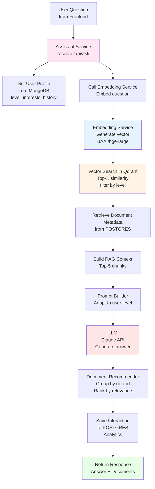
```mermaid
flowchart TD
    A["User Question<br/>from Frontend"]
    
    B["Assistant Service<br/>receive /api/ask"]
    
    C["Get User Profile<br/>from MongoDB<br/>level, interests, history"]
    
    D["Call Embedding Service<br/>Embed question"]
    
    E["Embedding Service<br/>Generate vector<br/>BAAI/bge-large"]
    
    F["Vector Search in Qdrant<br/>Top-K similarity<br/>filter by level"]
    
    G["Retrieve Document Metadata<br/>from POSTGRES"]
    
    H["Build RAG Context<br/>Top-5 chunks"]
    
    I["Prompt Builder<br/>Adapt to user level"]
    
    J["LLM<br/>Claude API<br/>Generate answer"]
    
    K["Document Recommender<br/>Group by doc_id<br/>Rank by relevance"]
    
    L["Save Interaction<br/>to POSTGRES<br/>Analytics"]
    
    M["Return Response<br/>Answer + Documents"]
    
    A --> B
    B --> C
    B --> D
    D --> E
    E --> F
    F --> G
    G --> H
    H --> I
    I --> J
    J --> K
    K --> L
    L --> M
    
    style B fill:#FFE6F3
    style E fill:#E6F3FF
    style F fill:#FFF3E6
    style J fill:#FFE6E6
    style M fill:#E6FFE6
```

---

### A.2. Chunk Size & Overlap Strategy

**Cấu hình tối ưu**:

```
Chunk Size:      400-600 tokens (~1500-2000 ký tự)
Overlap:         100-150 tokens (~400-500 ký tự)
Min Chunk Size:  100 tokens
Max Chunks:      1000 per document
```

**Tại sao cần chunking**:
- LLM có context limit (e.g., Claude 200K tokens)
- Semantic search chính xác hơn với chunk nhỏ
- Retrieval nhanh, ít scan vector DB
- Tránh lẫn lộn ý tưởng giữa các phần

**Ví dụ minh họa**:

```
Original document:
"Machine Learning là công nghệ cho phép máy tính học từ dữ liệu 
mà không cần lập trình trực tiếp. ML được chia thành 3 loại: 
Supervised Learning, Unsupervised Learning, Reinforcement Learning. 
Supervised Learning sử dụng dữ liệu có nhãn để huấn luyện mô hình..."

After chunking (size=500, overlap=100):

Chunk 1 (Token 0-500):
"Machine Learning là công nghệ cho phép máy tính học từ dữ liệu 
mà không cần lập trình trực tiếp. ML được chia thành 3 loại: 
Supervised Learning, Unsupervised Learning, Reinforcement Learning. 
Supervised Learning..."

Chunk 2 (Token 400-900):
"...Reinforcement Learning. Supervised Learning sử dụng dữ liệu 
có nhãn để huấn luyện mô hình. Ví dụ, phân loại email spam sử dụng 
labeled training data. Unsupervised Learning..."

Chunk 3 (Token 800-1300):
"...Unsupervised Learning tìm pattern ẩn trong dữ liệu không có nhãn. 
Clustering là một ví dụ phổ biến..."
```

**Lợi ích của overlap**:
- Tránh mất context ở ranh giới giữa các chunk
- Cải thiện semantic similarity matching
- Giảm fragmentation trong retrieval

---

### A.3. Metadata Schema

**Metadata lưu trong Qdrant**:

```
{
  "doc_id": "ML_COURSE_001",
  "chunk_id": 5,
  "title": "Machine Learning Fundamentals",
  "topic": "machine_learning",
  "subtopic": "supervised_learning",
  "level": "beginner",
  "source": "pdf",
  "source_url": "s3://bucket/ml_course_001.pdf",
  "upload_date": "2026-03-06",
  "author": "Dr. John Smith",
  "course_id": "course_123",
  "language": "vi",
  "text_preview": "Supervised Learning sử dụng dữ liệu có nhãn...",
  "duration_minutes": 30,
  "estimated_reading_time": 8,
  "tags": ["machine-learning", "supervised", "classification"],
  "version": 1,
  "archived": false
}
```

**Vai trò của metadata**:

| Field | Ý nghĩa | Sử dụng | Ví dụ |
|-------|---------|--------|-------|
| doc_id | ID tài liệu | Grouping kết quả | ML_COURSE_001 |
| level | Độ khó | Filter theo user level | beginner/intermediate/advanced |
| topic | Chủ đề | Phân loại, matching | machine_learning |
| source | Loại tài liệu | Filter, UI display | pdf/video/text |
| tags | Từ khóa | Search, matching | [supervised, classification] |
| course_id | Khóa học | Ngữ cảnh học | course_123 |

**Filtering logic trong Vector Search**:

```
User Profile:
- level: "beginner"
- interests: ["machine_learning", "python"]
- enrolled_course: "course_123"

Vector Search Filter:
- level <= "beginner"  (only beginner documents)
- topic IN interests   (match user interests)
- course_id IN enrolled_courses  (course-specific)
- language = "vi"      (Vietnamese content)
- archived = false

Result: Top-5 most relevant chunks matching all filters
```

---

### A.4. Level-Adaptive Prompting

**Three user levels**:

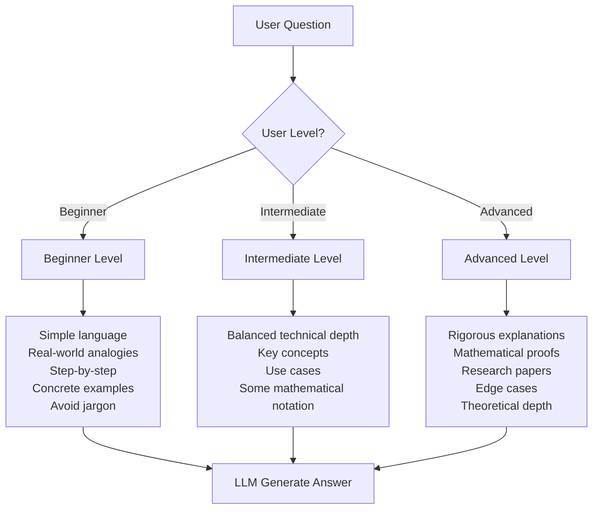
```mermaid
graph TD
    A["User Question"]
    B{"User Level?"}
    
    C["Beginner Level"]
    D["Simple language<br/>Real-world analogies<br/>Step-by-step<br/>Concrete examples<br/>Avoid jargon"]
    
    E["Intermediate Level"]
    F["Balanced technical depth<br/>Key concepts<br/>Use cases<br/>Some mathematical notation"]
    
    G["Advanced Level"]
    H["Rigorous explanations<br/>Mathematical proofs<br/>Research papers<br/>Edge cases<br/>Theoretical depth"]
    
    I["LLM Generate Answer"]
    
    A --> B
    B -->|Beginner| C
    B -->|Intermediate| E
    B -->|Advanced| G
    
    C --> D
    E --> F
    G --> H
    
    D --> I
    F --> I
    H --> I
```

**Example: User asks "What is overfitting?"**

```
Beginner Response:
"Imagine you're learning to recognize cats by showing the model 
thousands of cat photos. If you keep training too long on the SAME 
photos, the model memorizes them instead of learning what makes a 
cat a cat. When you show it a NEW cat photo it hasn't seen, it fails! 
That's overfitting."

Intermediate Response:
"Overfitting occurs when a model learns the training data distribution 
too closely, including noise and idiosyncrasies. Characteristics:
- Training error decreases, but validation error increases
- Model complexity too high relative to training set
- Insufficient regularization
Solutions: Cross-validation, L1/L2 regularization, Early stopping"

Advanced Response:
"In statistical learning theory, overfitting represents the bias-
variance tradeoff. The test error decomposes as:
E[(y - f̂(x))²] = Bias²(f̂) + Var(f̂) + σ²
Overfitting manifests as high variance, low bias regimes. Per Zhang 
et al. (2017), SGD provides implicit regularization through..."
```

---

### A.5. Document Recommendation Engine

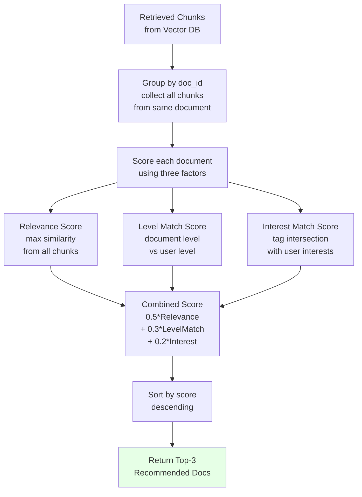
```mermaid
flowchart TD
    A["Retrieved Chunks<br/>from Vector DB"]
    
    B["Group by doc_id<br/>collect all chunks<br/>from same document"]
    
    C["Score each document<br/>using three factors"]
    
    D["Relevance Score<br/>max similarity<br/>from all chunks"]
    
    E["Level Match Score<br/>document level<br/>vs user level"]
    
    F["Interest Match Score<br/>tag intersection<br/>with user interests"]
    
    G["Combined Score<br/>0.5*Relevance<br/>+ 0.3*LevelMatch<br/>+ 0.2*Interest"]
    
    H["Sort by score<br/>descending"]
    
    I["Return Top-3<br/>Recommended Docs"]
    
    A --> B
    B --> C
    C --> D
    C --> E
    C --> F
    
    D --> G
    E --> G
    F --> G
    
    G --> H
    H --> I
    
    style I fill:#E6FFE6
```

**Response format**:

```json
{
  "question": "What is overfitting?",
  
  "answer": "Overfitting occurs when a model learns the training 
            data too well, including noise...",
  
  "recommended_documents": [
    {
      "doc_id": "ML_COURSE_001",
      "title": "Machine Learning Fundamentals",
      "topic": "supervised_learning",
      "level": "beginner",
      "source": "pdf",
      "estimated_reading_time": "8 min",
      "relevance_score": 0.94,
      "matching_tags": ["supervised", "classification"],
      "url": "https://weupbook.com/materials/ML_COURSE_001"
    },
    {
      "doc_id": "VALIDATION_002",
      "title": "Model Validation Techniques",
      "level": "intermediate",
      "estimated_reading_time": "15 min",
      "relevance_score": 0.87,
      "url": "https://weupbook.com/materials/VALIDATION_002"
    }
  ],
  
  "confidence": 0.92,
  "response_time_ms": 1245
}
```

---

## PHẦN B: AUTOMATION WORKFLOW

### B.1. Overview Workflow

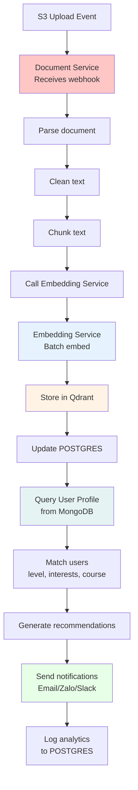
```mermaid
flowchart TD
    A["S3 Upload Event"]
    B["Document Service<br/>Receives webhook"]
    C["Parse document"]
    D["Clean text"]
    E["Chunk text"]
    F["Call Embedding Service"]
    G["Embedding Service<br/>Batch embed"]
    H["Store in Qdrant"]
    I["Update POSTGRES"]
    J["Query User Profile<br/>from MongoDB"]
    K["Match users<br/>level, interests, course"]
    L["Generate recommendations"]
    M["Send notifications<br/>Email/Zalo/Slack"]
    N["Log analytics<br/>to POSTGRES"]
    
    A --> B
    B --> C
    C --> D
    D --> E
    E --> F
    F --> G
    G --> H
    H --> I
    I --> J
    J --> K
    K --> L
    L --> M
    M --> N
    
    style B fill:#FFC6C6
    style G fill:#E6F3FF
    style H fill:#FFF3E6
    style J fill:#E6F3F3
    style M fill:#E6FFE6
```

---

### B.2. Detailed Workflow - Document Service

#### Document Service Responsibilities

```
Document Service (Port 8001)
├── Handle S3 Events
│   ├── Receive webhook from S3
│   ├── Validate event
│   └── Queue for processing
│
├── Document Processing
│   ├── Fetch file from S3
│   ├── Detect file type (PDF/DOCX/TXT/VTT)
│   ├── Parse content
│   ├── Extract metadata
│   └── Clean text
│
├── Chunking
│   ├── Split text with overlap
│   ├── Validate chunk size
│   ├── Prepare batch
│   └── Store to POSTGRES staging
│
├── Orchestration
│   ├── Call Embedding Service API
│   ├── Handle batch responses
│   ├── Update index status
│   └── Error handling & retry
│
└── Storage Management
    ├── Save to POSTGRES (document metadata)
    ├── Query POSTGRES (document history)
    └── Handle failures gracefully
```

#### Step 1: S3 Event Trigger

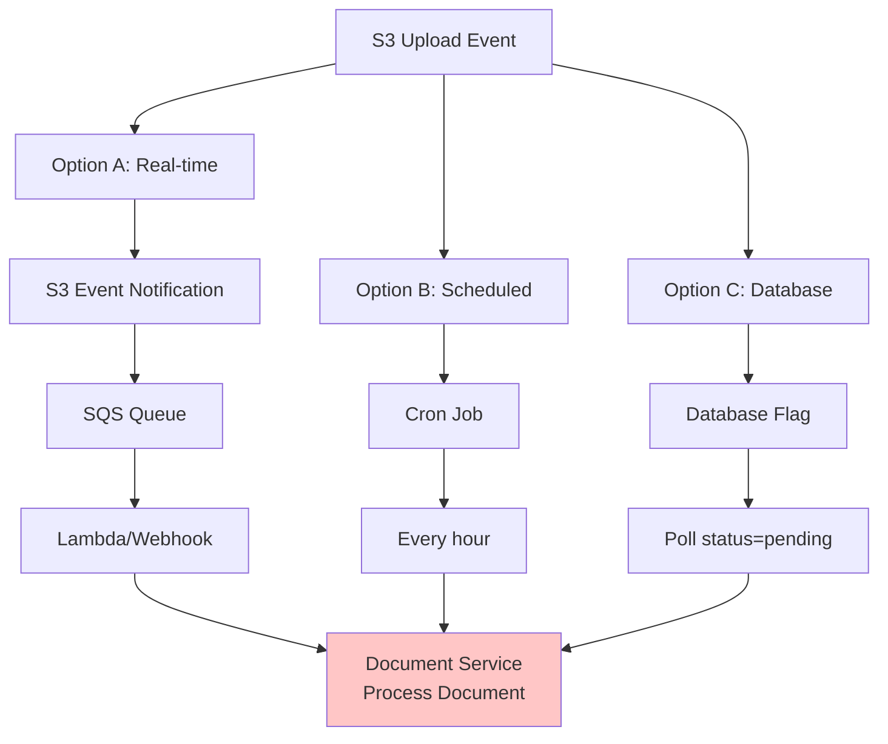
```mermaid
graph TD
    A["S3 Upload Event"]
    
    B["Option A: Real-time"]
    C["S3 Event Notification"]
    D["SQS Queue"]
    E["Lambda/Webhook"]
    
    F["Option B: Scheduled"]
    G["Cron Job"]
    G1["Every hour"]
    
    H["Option C: Database"]
    I["Database Flag"]
    I1["Poll status=pending"]
    
    J["Document Service<br/>Process Document"]
    
    A --> B
    B --> C
    C --> D
    D --> E
    
    A --> F
    F --> G
    G --> G1
    
    A --> H
    H --> I
    I --> I1
    
    E --> J
    G1 --> J
    I1 --> J
    
    style J fill:#FFC6C6
```

**Webhook Payload**:

```json
{
  "event_type": "s3:ObjectCreated:Put",
  "bucket": "weupbook-learning",
  "key": "uploads/2026-03-06/Machine_Learning_101.pdf",
  "size": 5242880,
  "timestamp": "2026-03-06T10:30:00Z",
  "content_type": "application/pdf",
  "metadata": {
    "course_id": "course_123",
    "instructor_id": "user_456",
    "topic": "machine_learning",
    "level": "beginner"
  }
}
```

---

#### Step 2: Document Parsing

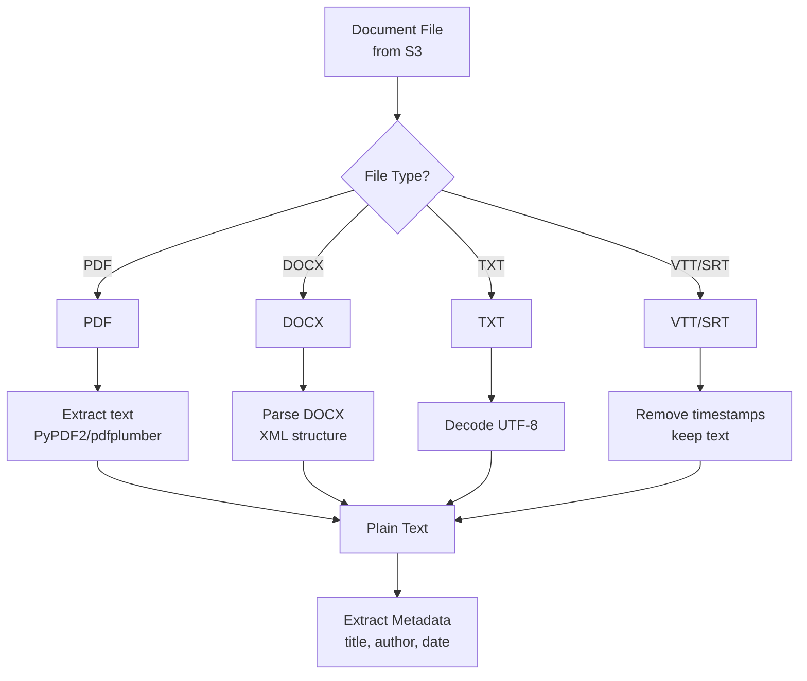
```mermaid
graph TD
    A["Document File<br/>from S3"]
    B{"File Type?"}
    
    C["PDF"]
    D["DOCX"]
    E["TXT"]
    F["VTT/SRT"]
    
    G["Extract text<br/>PyPDF2/pdfplumber"]
    H["Parse DOCX<br/>XML structure"]
    I["Decode UTF-8"]
    J["Remove timestamps<br/>keep text"]
    
    K["Plain Text"]
    
    L["Extract Metadata<br/>title, author, date"]
    
    A --> B
    B -->|PDF| C
    B -->|DOCX| D
    B -->|TXT| E
    B -->|VTT/SRT| F
    
    C --> G
    D --> H
    E --> I
    F --> J
    
    G --> K
    H --> K
    I --> K
    J --> K
    
    K --> L
```

---

#### Step 3: Text Cleaning

```
Operations:
1. Remove headers/footers (page numbers, margins)
2. Remove multiple consecutive newlines (normalize to max 2)
3. Normalize Unicode (keep Vietnamese characters)
4. Remove extra whitespace (collapse spaces)
5. Fix punctuation spacing
6. Remove special characters (keep meaningful ones)
7. Trim leading/trailing whitespace

Before:
"Machine   Learning  is  \n\nPage 1\n\n
a   technique...  (  example  )"

After:
"Machine Learning is a technique... (example)"
```

---

#### Step 4: Chunking & Storage

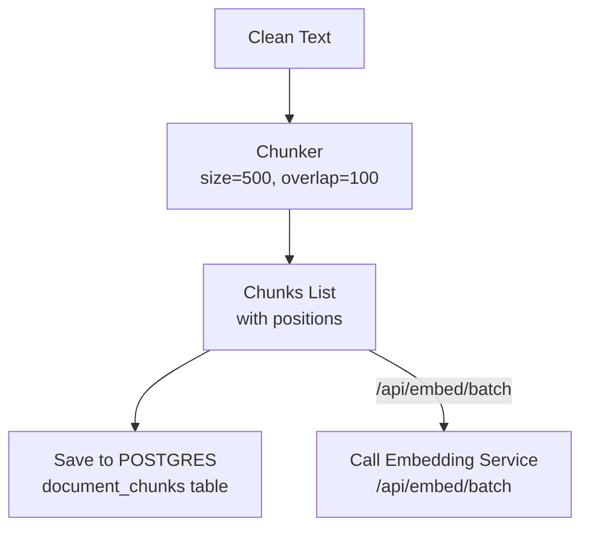
```mermaid
graph TD
    A["Clean Text"]
    B["Chunker<br/>size=500, overlap=100"]
    C["Chunks List<br/>with positions"]
    D["Save to POSTGRES<br/>document_chunks table"]
    E["Call Embedding Service<br/>/api/embed/batch"]
    
    A --> B
    B --> C
    C --> D
    C -->|/api/embed/batch| E
```

**POSTGRES Schema - document_chunks**:

```
Columns:
- chunk_id: UUID (primary key)
- doc_id: VARCHAR (references documents.doc_id)
- chunk_sequence: INTEGER (order in document)
- text: TEXT (actual chunk content)
- token_count: INTEGER
- start_position: INTEGER
- end_position: INTEGER
- created_at: TIMESTAMP
- status: VARCHAR (pending/embedded/indexed)
```

---

### B.3. Detailed Workflow - Embedding Service

#### Embedding Service Responsibilities

```
Embedding Service (Port 8002)
├── Model Management
│   ├── Load BAAI/bge-large-en-v1.5
│   ├── Cache model in memory
│   └── Handle model versioning
│
├── Batch Embedding
│   ├── Receive batch requests
│   ├── Normalize text
│   ├── Process in batches of 32
│   ├── Generate dense vectors (1024-d)
│   └── Return embeddings
│
├── Quality Control
│   ├── Validate vector dimension
│   ├── Check vector magnitude
│   └── Handle errors gracefully
│
└── Performance
    ├── Batch processing for efficiency
    ├── GPU acceleration (if available)
    └── Response caching
```

#### Flow: Batch Embedding

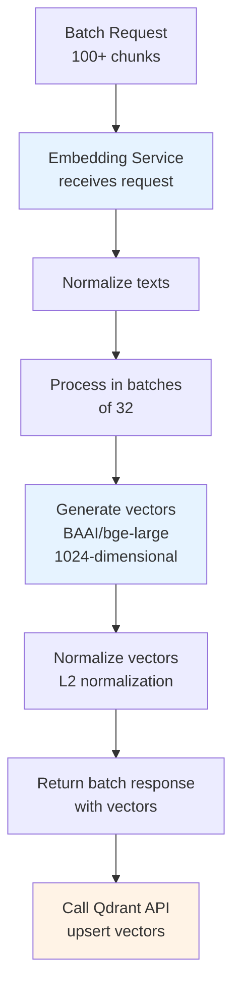
```mermaid
graph TD
    A["Batch Request<br/>100+ chunks"]
    B["Embedding Service<br/>receives request"]
    C["Normalize texts"]
    D["Process in batches<br/>of 32"]
    E["Generate vectors<br/>BAAI/bge-large<br/>1024-dimensional"]
    F["Normalize vectors<br/>L2 normalization"]
    G["Return batch response<br/>with vectors"]
    H["Call Qdrant API<br/>upsert vectors"]
    
    A --> B
    B --> C
    C --> D
    D --> E
    E --> F
    F --> G
    G --> H
    
    style B fill:#E6F3FF
    style E fill:#E6F3FF
    style H fill:#FFF3E6
```

**API Request/Response**:

```json
POST /api/embed/batch

Request:
{
  "texts": [
    "Machine Learning is...",
    "Supervised Learning uses...",
    "Unsupervised Learning finds..."
  ],
  "normalize": true
}

Response:
{
  "embeddings": [
    [0.123, -0.456, 0.789, ...],  // 1024 dimensions
    [0.111, 0.222, 0.333, ...],
    [0.555, -0.666, 0.777, ...]
  ],
  "count": 3,
  "dimension": 1024,
  "model": "BAAI/bge-large-en-v1.5",
  "processing_time_ms": 245
}
```

---

### B.4. Detailed Workflow - Assistant Service

#### Assistant Service Responsibilities

```
Assistant Service (Port 8003)
├── RAG Pipeline
│   ├── Receive user question
│   ├── Call Embedding Service
│   ├── Vector search in Qdrant
│   ├── Retrieve document metadata
│   └── Build context
│
├── LLM Integration
│   ├── Build level-adaptive prompt
│   ├── Call Claude API
│   ├── Handle streaming responses
│   └── Parse LLM output
│
├── Recommendation Engine
│   ├── Group search results
│   ├── Score documents
│   ├── Deduplication
│   ├── Topic diversity
│   └── Rank by relevance
│
├── User Profile
│   ├── Query MongoDB
│   ├── Fetch user level
│   ├── Get interests
│   └── Check history
│
└── Analytics
    ├── Save interactions
    ├── Track engagement
    └── Log to POSTGRES
```

#### Flow: User asks Question

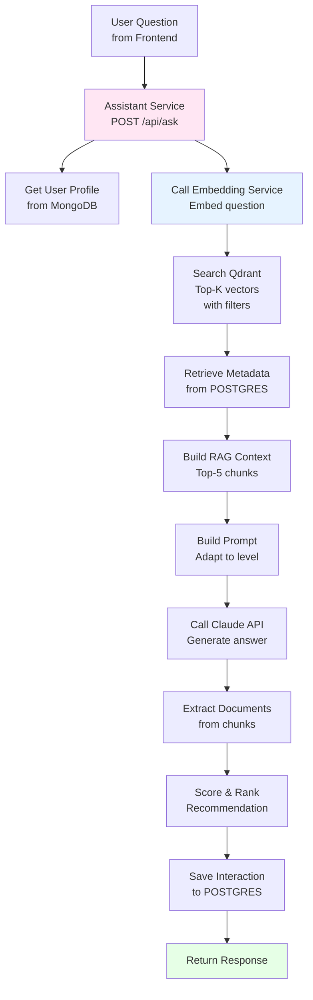
```mermaid
graph TD
    A["User Question<br/>from Frontend"]
    B["Assistant Service<br/>POST /api/ask"]
    
    C["Get User Profile<br/>from MongoDB"]
    
    D["Call Embedding Service<br/>Embed question"]
    
    E["Search Qdrant<br/>Top-K vectors<br/>with filters"]
    
    F["Retrieve Metadata<br/>from POSTGRES"]
    
    G["Build RAG Context<br/>Top-5 chunks"]
    
    H["Build Prompt<br/>Adapt to level"]
    
    I["Call Claude API<br/>Generate answer"]
    
    J["Extract Documents<br/>from chunks"]
    
    K["Score & Rank<br/>Recommendation"]
    
    L["Save Interaction<br/>to POSTGRES"]
    
    M["Return Response"]
    
    A --> B
    B --> C
    B --> D
    D --> E
    E --> F
    F --> G
    G --> H
    H --> I
    I --> J
    J --> K
    K --> L
    L --> M
    
    style B fill:#FFE6F3
    style D fill:#E6F3FF
    style M fill:#E6FFE6
```

---

#### Step 1: User Profile Matching

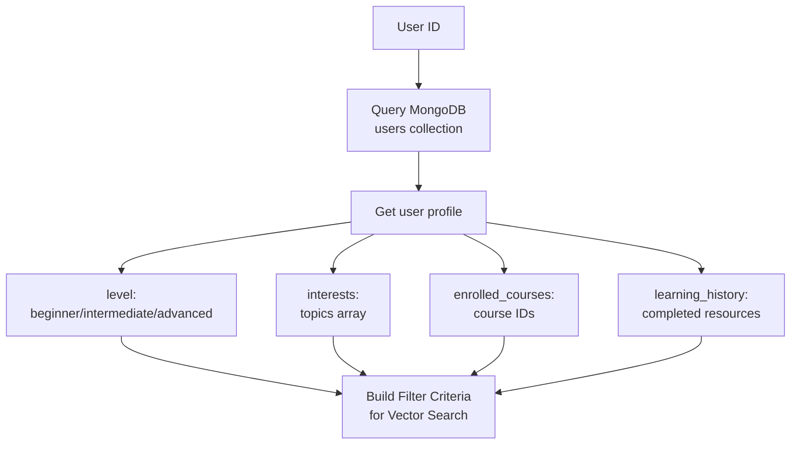
```mermaid
graph TD
    A["User ID"]
    B["Query MongoDB<br/>users collection"]
    C["Get user profile"]
    
    D["level:<br/>beginner/intermediate/advanced"]
    E["interests:<br/>topics array"]
    F["enrolled_courses:<br/>course IDs"]
    G["learning_history:<br/>completed resources"]
    
    H["Build Filter Criteria<br/>for Vector Search"]
    
    A --> B
    B --> C
    C --> D
    C --> E
    C --> F
    C --> G
    
    D --> H
    E --> H
    F --> H
    G --> H
```

**MongoDB Schema - users**:

```
{
  "_id": ObjectId,
  "user_id": "user_123",
  "email": "user@example.com",
  "level": "intermediate",
  "interests": ["machine_learning", "python"],
  "enrolled_courses": ["course_123", "course_456"],
  "learning_history": [
    {
      "doc_id": "ML_001",
      "completed": true,
      "rating": 5,
      "time_spent_minutes": 30,
      "accessed_at": "2026-03-05T10:30:00Z"
    }
  ],
  "notification_preferences": {
    "email": true,
    "zalo": true,
    "in_app": true
  },
  "created_at": "2026-01-01T00:00:00Z",
  "updated_at": "2026-03-06T00:00:00Z"
}
```

---

#### Step 2: Vector Search with Filters

```
Vector Search Query:
{
  "vector": [0.123, -0.456, ...],  // question embedding
  "limit": 5,
  "filters": {
    "level": {
      "$lte": "intermediate"  // <= user level
    },
    "topic": {
      "$in": ["machine_learning", "python"]
    },
    "course_id": {
      "$in": ["course_123"]
    },
    "language": "vi",
    "archived": false
  }
}

Result: Top-5 most relevant chunks matching all filters
```

---

#### Step 3: Recommendation Scoring

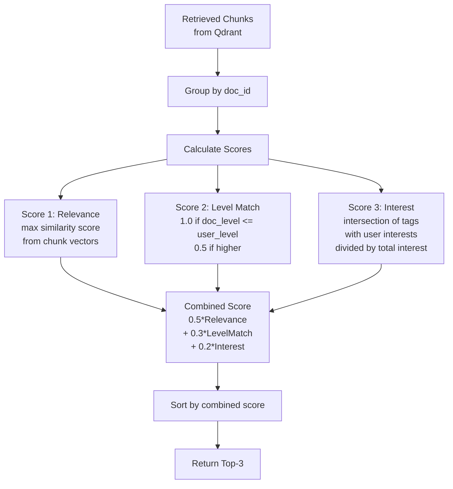
```mermaid
graph TD
    A["Retrieved Chunks<br/>from Qdrant"]
    
    B["Group by doc_id"]
    
    C["Calculate Scores"]
    
    D["Score 1: Relevance<br/>max similarity score<br/>from chunk vectors"]
    
    E["Score 2: Level Match<br/>1.0 if doc_level <= user_level<br/>0.5 if higher"]
    
    F["Score 3: Interest<br/>intersection of tags<br/>with user interests<br/>divided by total interest"]
    
    G["Combined Score<br/>0.5*Relevance<br/>+ 0.3*LevelMatch<br/>+ 0.2*Interest"]
    
    H["Sort by combined score"]
    
    I["Return Top-3"]
    
    A --> B
    B --> C
    C --> D
    C --> E
    C --> F
    D --> G
    E --> G
    F --> G
    G --> H
    H --> I
```

---

### B.5. User Matching & Notification

#### Find Matching Users

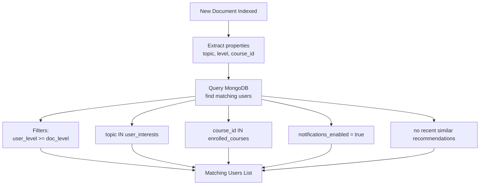
```mermaid
graph TD
    A["New Document Indexed"]
    B["Extract properties<br/>topic, level, course_id"]
    
    C["Query MongoDB<br/>find matching users"]
    
    D["Filters:<br/>user_level >= doc_level"]
    E["topic IN user_interests"]
    F["course_id IN enrolled_courses"]
    G["notifications_enabled = true"]
    H["no recent similar recommendations"]
    
    I["Matching Users List"]
    
    A --> B
    B --> C
    C --> D
    C --> E
    C --> F
    C --> G
    C --> H
    
    D --> I
    E --> I
    F --> I
    G --> I
    H --> I
```

**MongoDB Query Pattern**:

```
Find users where:
- level >= document_level
- document_topic IN interests
- document_course_id IN enrolled_courses
- notification_enabled = true
- NOT (recently recommended similar doc within 7 days)
- Limit 1000 users
```

---

#### Send Notifications

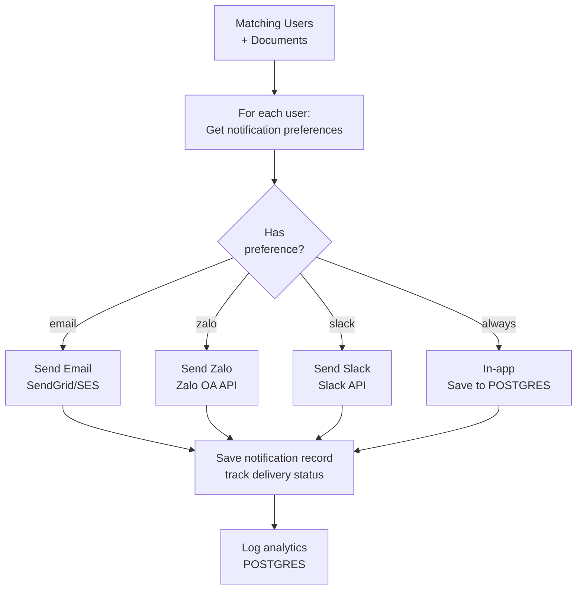
```mermaid
graph TD
    A["Matching Users<br/>+ Documents"]
    
    B["For each user:<br/>Get notification preferences"]
    
    C{"Has<br/>preference?"}
    
    D["Send Email<br/>SendGrid/SES"]
    E["Send Zalo<br/>Zalo OA API"]
    F["Send Slack<br/>Slack API"]
    G["In-app<br/>Save to POSTGRES"]
    
    H["Save notification record<br/>track delivery status"]
    
    I["Log analytics<br/>POSTGRES"]
    
    A --> B
    B --> C
    C -->|email| D
    C -->|zalo| E
    C -->|slack| F
    C -->|always| G
    
    D --> H
    E --> H
    F --> H
    G --> H
    
    H --> I
```

**Notification Channels**:

| Channel | Format | Speed | Reliability |
|---------|--------|-------|-------------|
| Email | HTML template | 1-5 min | High |
| Zalo | Text + buttons | 10-30 sec | High |
| Slack | Formatted message | Instant | High |
| In-app | DB record | Instant | Highest |

---

### B.6. Error Handling & Retry

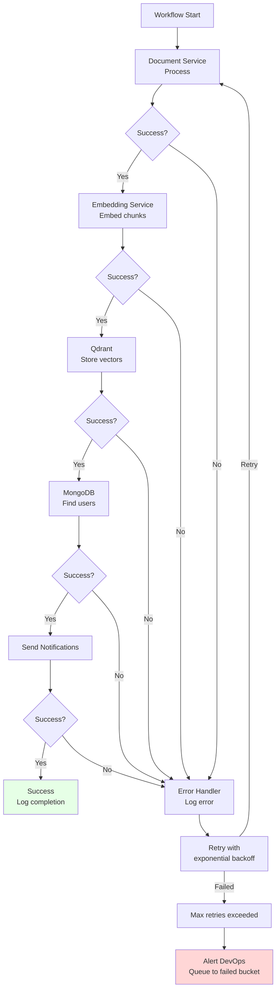
```mermaid
graph TD
    A["Workflow Start"]
    
    B["Document Service<br/>Process"]
    C{"Success?"}
    
    D["Embedding Service<br/>Embed chunks"]
    E{"Success?"}
    
    F["Qdrant<br/>Store vectors"]
    G{"Success?"}
    
    H["MongoDB<br/>Find users"]
    I{"Success?"}
    
    J["Send Notifications"]
    K{"Success?"}
    
    L["Success<br/>Log completion"]
    
    M["Error Handler<br/>Log error"]
    N["Retry with<br/>exponential backoff"]
    O["Max retries exceeded"]
    P["Alert DevOps<br/>Queue to failed bucket"]
    
    A --> B
    B --> C
    C -->|Yes| D
    C -->|No| M
    
    D --> E
    E -->|Yes| F
    E -->|No| M
    
    F --> G
    G -->|Yes| H
    G -->|No| M
    
    H --> I
    I -->|Yes| J
    I -->|No| M
    
    J --> K
    K -->|Yes| L
    K -->|No| M
    
    M --> N
    N -->|Retry| B
    N -->|Failed| O
    O --> P
    
    style L fill:#E6FFE6
    style P fill:#FFD6D6
```

**Error Scenarios**:

```
Error Type          Recovery Strategy
─────────────────────────────────────────
S3 file not found   Log error, skip, notify admin
PDF corrupt         Try alt parser, move to failed bucket
Embed timeout       Retry 3x with exponential backoff
Qdrant down         Queue and retry later
User DB down        Use cache, queue for later
Rate limit          Queue in Redis, delayed processing
Email bounce        Mark invalid, try Zalo fallback
```

---

## PHẦN C: OPTIMIZATION

### C.1. Tiết kiệm Token (70% cost reduction)

#### Semantic Caching

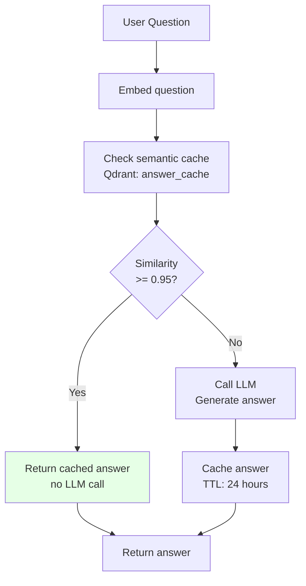
```mermaid
graph TD
    A["User Question"]
    B["Embed question"]
    C["Check semantic cache<br/>Qdrant: answer_cache"]
    
    D{"Similarity<br/>>= 0.95?"}
    
    E["Return cached answer<br/>no LLM call"]
    
    F["Call LLM<br/>Generate answer"]
    
    G["Cache answer<br/>TTL: 24 hours"]
    
    H["Return answer"]
    
    A --> B
    B --> C
    C --> D
    D -->|Yes| E
    D -->|No| F
    
    E --> H
    F --> G
    G --> H
    
    style E fill:#E6FFE6
```

**Benefit**: ~50-70% hit rate = 70% cost reduction

---

#### Prompt Optimization

```
Before optimization:
- Context: 2000 tokens
- Prompt: 500 tokens
- Total: 2500 tokens → $0.05

After optimization:
- Select Top-3 chunks (not 5)
- Summarize each chunk
- Shorter prompt template
- Context: 1200 tokens
- Prompt: 300 tokens
- Total: 1500 tokens → $0.03

Savings: 40% per query
```

---

#### Batch Processing

```
Without batching:
10 documents × 10 chunks = 10 API calls

With batching:
1 batch call (embed 100 chunks) + 1 bulk insert

Reduction: 90% API calls to embedding service
```

---

### C.2. Tránh Gợi ý Trùng lặp

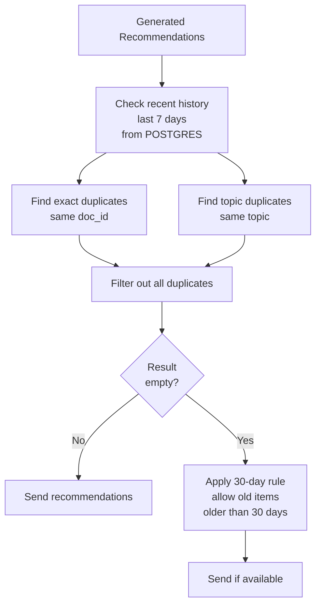
```mermaid
graph TD
    A["Generated Recommendations"]
    
    B["Check recent history<br/>last 7 days<br/>from POSTGRES"]
    
    C["Find exact duplicates<br/>same doc_id"]
    
    D["Find topic duplicates<br/>same topic"]
    
    E["Filter out all duplicates"]
    
    F{"Result<br/>empty?"}
    
    G["Send recommendations"]
    
    H["Apply 30-day rule<br/>allow old items<br/>older than 30 days"]
    
    I["Send if available"]
    
    A --> B
    B --> C
    B --> D
    C --> E
    D --> E
    
    E --> F
    F -->|No| G
    F -->|Yes| H
    H --> I
```

---

### C.3. Topic Diversity

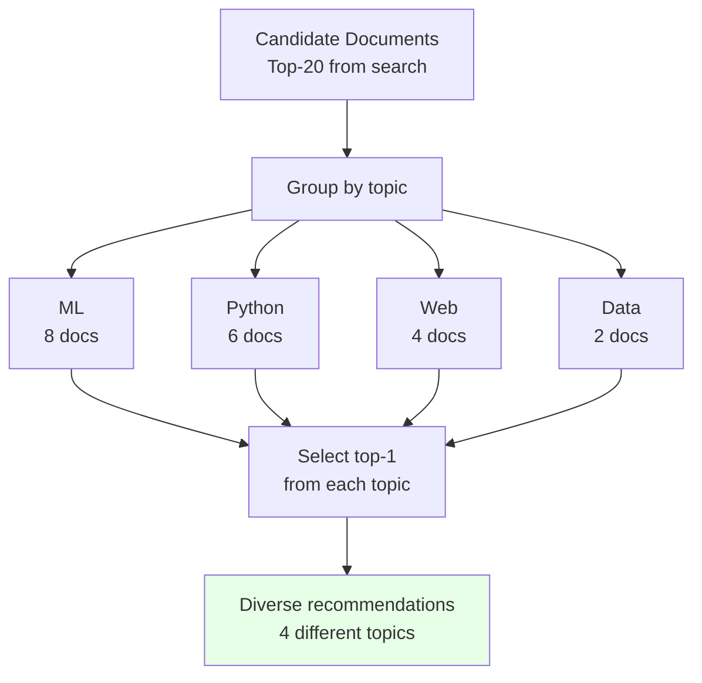
```mermaid
graph TD
    A["Candidate Documents<br/>Top-20 from search"]
    
    B["Group by topic"]
    
    C["ML<br/>8 docs"]
    D["Python<br/>6 docs"]
    E["Web<br/>4 docs"]
    F["Data<br/>2 docs"]
    
    G["Select top-1<br/>from each topic"]
    
    H["Diverse recommendations<br/>4 different topics"]
    
    A --> B
    B --> C
    B --> D
    B --> E
    B --> F
    
    C --> G
    D --> G
    E --> G
    F --> G
    
    G --> H
    
    style H fill:#E6FFE6
```

---

### C.4. Personalization

```
User Profile Analysis:
- Learning history (last 90 days)
- Topic preferences (completion rate per topic)
- Learning style (video/text/interactive)
- Preferred difficulty
- Recent achievements

Recommendation Adaptation:
- Adjust message tone
- Prioritize preferred learning style
- Match difficulty level
- Highlight relevant tags
- Suggest next logical step in learning path
```

---

## PHẦN D: DATABASE SCHEMA

### PostgreSQL (Relational Data)

```
Tables:
├── documents
│   ├── doc_id (PK)
│   ├── title
│   ├── topic
│   ├── level
│   ├── source
│   ├── upload_date
│   ├── chunk_count
│   └── status (pending/indexed)
│
├── document_chunks
│   ├── chunk_id (PK)
│   ├── doc_id (FK)
│   ├── text
│   ├── token_count
│   ├── status
│   └── created_at
│
├── user_interactions
│   ├── interaction_id (PK)
│   ├── user_id
│   ├── question
│   ├── answer
│   ├── response_time_ms
│   └── timestamp
│
└── user_recommendations
    ├── rec_id (PK)
    ├── user_id
    ├── doc_id
    ├── notification_channel
    ├── status (sent/failed)
    └── created_at
```

---

### MongoDB (User Data & History)

```
Collections:
├── users
│   ├── _id
│   ├── user_id
│   ├── email, phone
│   ├── level
│   ├── interests (array)
│   ├── enrolled_courses (array)
│   ├── learning_history (array)
│   └── notification_preferences
│
└── user_activity
    ├── _id
    ├── user_id
    ├── activity_type (view/read/complete)
    ├── doc_id
    ├── timestamp
    └── metadata
```

---

### Qdrant Vector Store

```
Collection: learning_materials
├── Vector: 1024-dimensional dense vectors
├── Point ID: doc_id_chunk_id
└── Payload (Metadata):
    ├── doc_id
    ├── chunk_id
    ├── text_preview
    ├── topic
    ├── level
    ├── source
    ├── tags
    ├── language
    └── indexed_at
```

---

## SUMMARY: WORKFLOW TERINTEGRASI

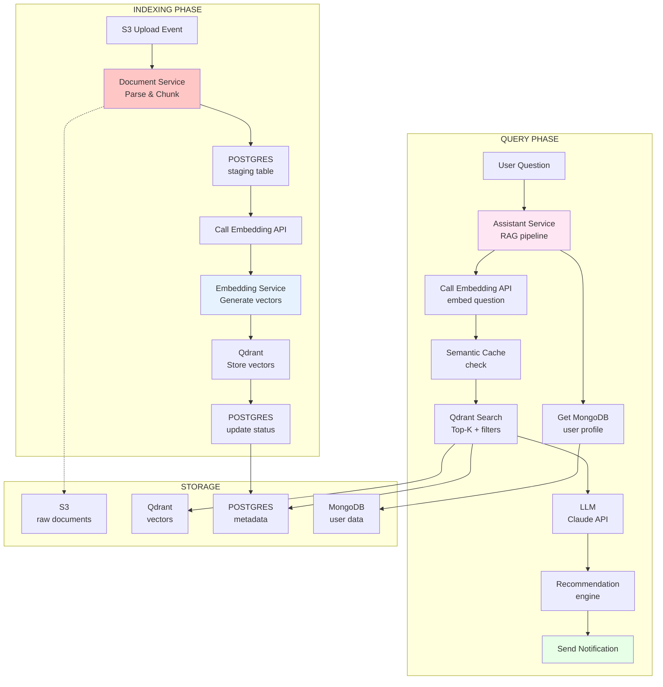
```mermaid
flowchart TD
    subgraph "INDEXING PHASE"
        A["S3 Upload Event"]
        B["Document Service<br/>Parse & Chunk"]
        C["POSTGRES<br/>staging table"]
        D["Call Embedding API"]
        E["Embedding Service<br/>Generate vectors"]
        F["Qdrant<br/>Store vectors"]
        G["POSTGRES<br/>update status"]
    end
    
    subgraph "QUERY PHASE"
        H["User Question"]
        I["Assistant Service<br/>RAG pipeline"]
        J["Get MongoDB<br/>user profile"]
        K["Call Embedding API<br/>embed question"]
        L["Qdrant Search<br/>Top-K + filters"]
        M["Semantic Cache<br/>check"]
        N["LLM<br/>Claude API"]
        O["Recommendation<br/>engine"]
        P["Send Notification"]
    end
    
    subgraph "STORAGE"
        Q["S3<br/>raw documents"]
        R["Qdrant<br/>vectors"]
        S["POSTGRES<br/>metadata"]
        T["MongoDB<br/>user data"]
    end
    
    A --> B
    B --> C
    C --> D
    D --> E
    E --> F
    F --> G
    
    H --> I
    I --> J
    I --> K
    J --> T
    K --> M
    M --> L
    L --> S
    L --> R
    L --> N
    N --> O
    O --> P
    
    B -.-> Q
    G --> S
    
    style B fill:#FFC6C6
    style E fill:#E6F3FF
    style I fill:#FFE6F3
    style P fill:#E6FFE6
```

---

## DEPLOYMENT & SCALING

### Docker Compose Structure

```
Services:
├── nginx (API Gateway)
├── document-service (Port 8001)
├── embedding-service (Port 8002)
├── assistant-service (Port 8003)
├── postgres (Port 5432)
├── mongo (Port 27017)
├── qdrant (Port 6333)
└── redis (Port 6379)
```

### Scaling Strategy

```
Horizontal Scaling:
- Document Service: Scale with # of documents
  → Multiple workers, queue-based processing
  
- Embedding Service: Scale with embedding requests
  → GPU-enabled workers, batch optimization
  
- Assistant Service: Scale with user queries
  → Stateless, load-balanced

Vertical Scaling:
- Qdrant: Increase vector DB memory
- MongoDB: Add replica sets
- PostgreSQL: Add read replicas
```

---

## PERFORMANCE TARGETS

```
Latency:
- User question → Answer: < 2 seconds
- Document indexing: < 5 minutes
- Notification delivery: < 1 minute

Token Cost:
- Avg tokens per query: < 500
- Cache hit rate: > 50%
- Cost reduction: 70%

User Engagement:
- Recommendation click-through: > 30%
- Document completion rate: > 60%
- User retention: > 80%

System Reliability:
- Uptime: > 99.9%
- Error rate: < 0.1%
- Retry success rate: > 95%
```

---

## CONCLUSION

### Hệ thống cung cấp:

✅ Clear microservices separation (Document Service + Assistant Service)
✅ Scalable data layer (S3 + Qdrant + MongoDB + PostgreSQL)
✅ RAG pipeline with level-adaptive prompts
✅ Automation workflow from S3 to notifications
✅ Optimization strategies for cost and performance
✅ Robust error handling and monitoring
✅ Production-ready architecture
